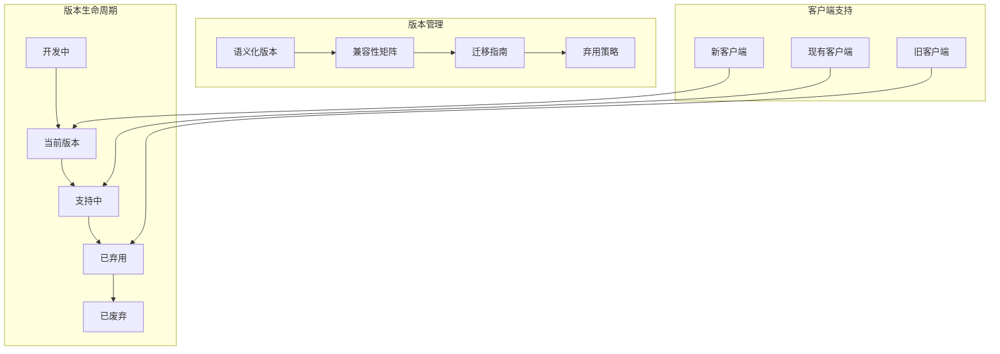

# API版本控制策略

**版本**: 1.0.0
**创建日期**: 2025-10-08
**目标**: 确保API演进的安全性和向后兼容性

## 📋 版本控制策略概览



## 🔢 版本控制规则

### 1. 语义化版本控制

```python
# versioning/semver.py
from dataclasses import dataclass
from typing import List, Optional
from enum import Enum

class VersionType(Enum):
    MAJOR = "major"    # 破坏性变更
    MINOR = "minor"    # 新功能，向后兼容
    PATCH = "patch"    # Bug修复，向后兼容

@dataclass
class APIVersion:
    major: int
    minor: int
    patch: int
    prerelease: Optional[str] = None
    build_metadata: Optional[str] = None

    def __str__(self) -> str:
        version = f"{self.major}.{self.minor}.{self.patch}"
        if self.prerelease:
            version += f"-{self.prerelease}"
        if self.build_metadata:
            version += f"+{self.build_metadata}"
        return version

    @classmethod
    def parse(cls, version_string: str) -> 'APIVersion':
        """解析版本字符串"""
        import re
        pattern = r'^(\d+)\.(\d+)\.(\d+)(?:-([0-9A-Za-z-]+(?:\.[0-9A-Za-z-]+)*))?(?:\+([0-9A-Za-z-]+(?:\.[0-9A-Za-z-]+)*))?$'
        match = re.match(pattern, version_string)

        if not match:
            raise ValueError(f"Invalid version string: {version_string}")

        major, minor, patch, prerelease, build_metadata = match.groups()

        return cls(
            major=int(major),
            minor=int(minor),
            patch=int(patch),
            prerelease=prerelease,
            build_metadata=build_metadata
        )

    def is_compatible_with(self, other: 'APIVersion') -> bool:
        """检查版本兼容性"""
        # 主版本号必须相同
        if self.major != other.major:
            return False

        # 新版本应该 >= 旧版本（对于相同主版本）
        if (self.minor, self.patch) < (other.minor, other.patch):
            return False

        return True

class VersionCompatibilityMatrix:
    """版本兼容性矩阵"""

    def __init__(self):
        self.matrix = {
            # 格式: client_version -> [server_versions]
            "1.0": ["1.0", "1.1", "1.2"],
            "1.1": ["1.1", "1.2"],
            "1.2": ["1.2"],
            "2.0": ["2.0", "2.1"],
            "2.1": ["2.1"],
        }

    def get_compatible_versions(self, client_version: str) -> List[str]:
        """获取客户端版本兼容的服务器版本"""
        return self.matrix.get(client_version, [])

    def is_version_supported(self, client_version: str, server_version: str) -> bool:
        """检查特定版本组合是否受支持"""
        compatible_versions = self.get_compatible_versions(client_version)
        return server_version in compatible_versions
```

### 2. 版本管理器

```python
# versioning/version_manager.py
from fastapi import FastAPI, Request, Response
from fastapi.middleware.base import BaseHTTPMiddleware
from typing import Dict, List, Optional
import logging
from datetime import datetime, timedelta
import redis

logger = logging.getLogger(__name__)

class APIVersionManager:
    def __init__(self, redis_client: redis.Redis):
        self.redis = redis_client
        self.current_version = APIVersion(1, 0, 0)
        self.supported_versions = [
            APIVersion(1, 0, 0),
            APIVersion(1, 1, 0),
        ]
        self.deprecated_versions = [
            APIVersion(0, 9, 0),  # 已弃用版本
        ]
        self.version_compatibility = VersionCompatibilityMatrix()

    async def get_version_info(self, version: str) -> Dict:
        """获取版本信息"""
        api_version = APIVersion.parse(version)

        return {
            "version": str(api_version),
            "status": self._get_version_status(api_version),
            "release_date": self._get_release_date(api_version),
            "deprecation_date": self._get_deprecation_date(api_version),
            "sunset_date": self._get_unset_date(api_version),
            "migration_guide": self._get_migration_guide(api_version),
            "supported_client_versions": self._get_supported_client_versions(api_version),
            "features": self._get_version_features(api_version),
            "breaking_changes": self._get_breaking_changes(api_version),
        }

    def _get_version_status(self, version: APIVersion) -> str:
        """获取版本状态"""
        if version in self.supported_versions:
            if version == self.current_version:
                return "current"
            else:
                return "supported"
        elif version in self.deprecated_versions:
            return "deprecated"
        else:
            return "unsupported"

    def _get_release_date(self, version: APIVersion) -> str:
        """获取版本发布日期"""
        date_key = f"version:release:{version}"
        date_str = self.redis.get(date_key)
        return date_str.decode() if date_str else "unknown"

    def _get_deprecation_date(self, version: APIVersion) -> Optional[str]:
        """获取版本弃用日期"""
        deprecation_key = f"version:deprecation:{version}"
        deprecation_str = self.redis.get(deprecation_key)
        return deprecation_str.decode() if deprecation_str else None

    def _get_unset_date(self, version: APIVersion) -> Optional[str]:
        """获取版本废弃日期"""
        unset_key = f"version:unset:{version}"
        unset_str = self.redis.get(unset_key)
        return unset_str.decode() if unset_str else None

    def _get_migration_guide(self, version: APIVersion) -> str:
        """获取版本迁移指南"""
        guide_key = f"version:migration:{version}"
        guide_str = self.redis.get(guide_key)
        return guide_str.decode() if guide_str else "No migration guide available"

    def _get_supported_client_versions(self, version: APIVersion) -> List[str]:
        """获取支持的客户端版本"""
        # 返回与此服务器版本兼容的客户端版本
        return ["1.0", "1.1", "1.2"]

    def _get_version_features(self, version: APIVersion) -> List[str]:
        """获取版本特性"""
        features = {
            "1.0": [
                "Basic trading operations",
                "Market data retrieval",
                "Order management",
                "Position tracking"
            ],
            "1.1": [
                "Enhanced security features",
                "WebSocket support",
                "Advanced filtering",
                "Rate limiting"
            ],
        }
        return features.get(str(version), [])

    def _get_breaking_changes(self, version: APIVersion) -> List[str]:
        """获取破坏性变更"""
        changes = {
            "1.1": [
                "Authentication header format changed",
                "Response structure updated for consistency",
                "Deprecated endpoints removed"
            ],
        }
        return changes.get(str(version), [])

    async def handle_version_request(self, request: Request) -> Dict:
        """处理版本请求"""
        client_version = request.headers.get("API-Version", "1.0")
        requested_version = request.headers.get("Accept-Version", client_version)

        try:
            api_version = APIVersion.parse(requested_version)
        except ValueError:
            # 如果版本格式无效，使用默认版本
            api_version = self.current_version
            logger.warning(f"Invalid version format: {requested_version}, using {api_version}")

        # 检查版本兼容性
        if not self._is_version_supported(api_version):
            logger.warning(f"Unsupported version requested: {api_version}")
            return self._create_version_error_response(api_version)

        # 更新版本使用统计
        await self._record_version_usage(api_version, request)

        return {
            "current_version": str(self.current_version),
            "requested_version": str(api_version),
            "is_compatible": self._is_version_compatible(api_version, APIVersion.parse(client_version)),
            "version_info": await self.get_version_info(str(api_version)),
        }

    def _is_version_supported(self, version: APIVersion) -> bool:
        """检查版本是否受支持"""
        return version in self.supported_versions

    def _is_version_compatible(self, requested: APIVersion, client: APIVersion) -> bool:
        """检查版本兼容性"""
        return self.version_compatibility.is_version_supported(str(client), str(requested))

    def _create_version_error_response(self, version: APIVersion) -> Dict:
        """创建版本错误响应"""
        status = self._get_version_status(version)

        if status == "deprecated":
            return {
                "error": "API_VERSION_DEPRECATED",
                "message": f"API version {version} is deprecated and will be removed soon",
                "current_version": str(self.current_version),
                "upgrade_guide": self._get_migration_guide(version),
                "deprecation_date": self._get_deprecation_date(version),
                "unset_date": self._get_unset_date(version),
            }
        else:
            return {
                "error": "API_VERSION_UNSUPPORTED",
                "message": f"API version {version} is not supported",
                "supported_versions": [str(v) for v in self.supported_versions],
                "current_version": str(self.current_version),
            }

    async def _record_version_usage(self, version: APIVersion, request: Request):
        """记录版本使用情况"""
        usage_key = f"version:usage:{version}:daily:{datetime.now().strftime('%Y-%m-%d')}"
        await self.redis.incr(usage_key)
        await self.redis.expire(usage_key, 86400)  # 30天过期

        # 记录详细的访问日志
        access_log = {
            "version": str(version),
            "endpoint": str(request.url),
            "method": request.method,
            "user_agent": request.headers.get("User-Agent"),
            "ip_address": request.client.host,
            "timestamp": datetime.now().isoformat(),
        }

        log_key = f"version:log:{version}:{datetime.now().strftime('%Y-%m-%d')}"
        await self.redis.lpush(log_key, str(access_log))
        await self.redis.ltrim(log_key, 0, 10000)  # 保持最新10000条记录

    async def deprecate_version(self, version: APIVersion, deprecation_date: datetime, unset_date: datetime):
        """弃用版本"""
        deprecation_key = f"version:deprecation:{version}"
        unset_key = f"version:unset:{version}"

        await self.redis.set(deprecation_key, deprecation_date.isoformat())
        await self.redis.set(unset_key, unset_date.isoformat())

        # 从支持列表中移除
        if version in self.supported_versions:
            self.supported_versions.remove(version)
            self.deprecated_versions.append(version)

        logger.info(f"Deprecated API version {version}: deprecation on {deprecation_date}, unset on {unset_date}")

    async def add_version(self, version: APIVersion, release_date: datetime):
        """添加新版本"""
        # 添加到支持列表
        self.supported_versions.append(version)

        # 记录发布日期
        release_key = f"version:release:{version}"
        await self.redis.set(release_key, release_date.isoformat())

        logger.info(f"Added new API version {version} released on {release_date}")
```

## 🔧 版本控制中间件

```python
# middleware/versioning_middleware.py
from fastapi import Request, Response, HTTPException
from fastapi.middleware.base import BaseHTTPMiddleware
import json
from typing import Optional

class APIVersioningMiddleware(BaseHTTPMiddleware):
    def __init__(self, app, version_manager: APIVersionManager):
        super().__init__(app)
        self.version_manager = version_manager

    async def dispatch(self, request: Request, call_next):
        # 处理版本请求头
        version_info = await self.version_manager.handle_version_request(request)

        # 如果版本不受支持，返回错误
        if "error" in version_info:
            return Response(
                content=json.dumps(version_info),
                status_code=400,
                media_type="application/json",
                headers={
                    "API-Version": str(self.version_manager.current_version),
                    "Content-Type": "application/json",
                }
            )

        # 设置版本信息到请求状态
        request.state.api_version = version_info["requested_version"]
        request.state.version_info = version_info

        # 调用下一个中间件或路由处理器
        response = await call_next(request)

        # 添加版本信息到响应头
        response.headers["API-Version"] = str(self.version_manager.current_version)

        # 如果客户端请求了特定版本，添加版本兼容性信息
        if "requested_version" in version_info:
            if version_info["is_compatible"]:
                response.headers["API-Version-Status"] = "compatible"
            else:
                response.headers["API-Version-Status"] = "incompatible"
                response.headers["API-Upgrade-Required"] = str(self.version_manager.current_version)

        # 添加版本弃用警告
        if "deprecation_date" in version_info.get("version_info", {}):
            response.headers["Deprecation"] = "true"
            response.headers["Sunset"] = version_info["version_info"]["unset_date"]

        return response
```

## 📝 版本控制配置

### 1. 版本配置文件

```yaml
# config/versioning.yaml
versioning:
  current_version: "1.0.0"
  supported_versions:
    - "1.0.0"
    - "1.1.0"

  deprecated_versions:
    "0.9.0":
      deprecation_date: "2025-01-01T00:00:00Z"
      unset_date: "2025-07-01T00:00:00Z"
      migration_guide: "/docs/migration/v0.9.0-to-v1.0.0.md"
      warning_message: "Version 0.9.0 is deprecated. Please upgrade to version 1.0.0 or later."

  compatibility_rules:
    # 主版本兼容性规则
    major_changes_require_migration: true
    minor_changes_backward_compatible: true
    patch_changes_backward_compatible: true

    # 弃用策略
    deprecation_warning_period: 180  # days
    support_period_after_deprecation: 90  # days

  endpoint_versioning:
    default_version: "1.0.0"
    version_in_url: true
    version_in_header: true
    query_param_version: "version"

  client_support:
    minimum_supported_version: "1.0.0"
    recommended_version: "1.1.0"
    version_detection_priority:
      - header
      - url
      - query
```

### 2. 版本化路由配置

```python
# routing/versioned_router.py
from fastapi import APIRouter, Depends, HTTPException
from typing import Dict, Any
from functools import wraps

def versioned_endpoint(min_version: str = None, max_version: str = None):
    """版本化端点装饰器"""
    def decorator(func):
        @wraps(func)
        async def wrapper(*args, **kwargs):
            request = kwargs.get("request")
            if not request:
                return await func(*args, **kwargs)

            api_version = request.state.api_version
            version_info = request.state.version_info

            # 检查版本兼容性
            if not version_info["is_compatible"]:
                raise HTTPException(
                    status_code=426,
                    detail="API version upgrade required",
                    headers={
                        "API-Version": str(request.state.version_manager.current_version),
                        "API-Upgrade-Required": str(request.state.version_manager.current_version),
                    }
                )

            # 检查最小版本要求
            if min_version and api_version < APIVersion.parse(min_version):
                raise HTTPException(
                    status_code=400,
                    detail=f"Minimum version {min_version} required for this endpoint"
                )

            # 检查最大版本限制
            if max_version and api_version > APIVersion.parse(max_version):
                raise HTTPException(
                    status_code=400,
                    detail=f"Version {max_version} is the maximum supported for this endpoint"
                )

            return await func(*args, **kwargs)
        return wrapper
    return decorator

class VersionedAPIRouter(APIRouter):
    """版本化API路由器"""

    def __init__(self, prefix: str = "", tags: list = None):
        super().__init__(prefix=prefix, tags=tags)
        self.versioned_endpoints = {}

    def add_versioned_endpoint(self, path: str, endpoint_func, **kwargs):
        """添加版本化端点"""
        self.versioned_endpoints[path] = endpoint_func
        self.add_api_route(path, endpoint_func, **kwargs)

    def get_endpoint_for_version(self, path: str, version: str):
        """根据版本获取端点"""
        # 根据版本返回不同的端点实现
        return self.versioned_endpoints.get(path)
```

## 🚨 版本弃用和迁移

### 1. 弃用策略

```python
# versioning/deprecation_manager.py
from datetime import datetime, timedelta
from typing import Dict, List
import asyncio

class DeprecationManager:
    def __init__(self, version_manager: APIVersionManager):
        self.version_manager = version_manager
        self.deprecation_tasks = []

    async def schedule_deprecation(self, version: str, deprecation_date: datetime, unset_date: datetime):
        """安排版本弃用"""
        delay = (deprecation_date - datetime.now()).total_seconds()

        if delay > 0:
            # 安排弃用任务
            task = asyncio.create_task(
                self._deprecate_after_delay(version, delay, unset_date)
            )
            self.deprecation_tasks.append(task)

            logger.info(f"Scheduled deprecation for version {version} at {deprecation_date}")
        else:
            # 立即弃用
            await self.version_manager.deprecate_version(
                APIVersion.parse(version), deprecation_date, unset_date
            )

    async def _deprecate_after_delay(self, version: str, delay: float, unset_date: datetime):
        """延迟执行弃用"""
        await asyncio.sleep(delay)

        try:
            await self.version_manager.deprecate_version(
                APIVersion.parse(version), datetime.now(), unset_date
            )
            await self._notify_deprecation(version)
        except Exception as e:
            logger.error(f"Failed to deprecate version {version}: {e}")

    async def _notify_deprecation(self, version: str):
        """通知版本弃用"""
        message = f"API version {version} has been deprecated"
        logger.warning(message)

        # 发送通知到监控系统
        # TODO: 实现具体的通知逻辑

    async def check_deprecated_versions(self):
        """检查过期版本"""
        current_time = datetime.now()

        for version in self.version_manager.deprecated_versions:
            unset_date_str = self.version_manager._get_unset_date(version)
            if unset_date_str:
                unset_date = datetime.fromisoformat(unset_date_str)
                if current_time >= unset_date:
                    await self._remove_version(version)

    async def _remove_version(self, version: APIVersion):
        """完全移除版本"""
        if version in self.version_manager.deprecated_versions:
            self.version_manager.deprecated_versions.remove(version)
            logger.info(f"Removed deprecated version {version}")
```

### 2. 迁移指南生成

```python
# versioning/migration_guide_generator.py
class MigrationGuideGenerator:
    def __init__(self, version_manager: APIVersionManager):
        self.version_manager = version_manager

    def generate_migration_guide(self, from_version: str, to_version: str) -> Dict:
        """生成迁移指南"""
        from_v = APIVersion.parse(from_version)
        to_v = APIVersion.parse(to_version)

        guide = {
            "title": f"Migration Guide: {from_version} → {to_version}",
            "overview": self._generate_overview(from_v, to_v),
            "breaking_changes": self._list_breaking_changes(from_v, to_v),
            "required_actions": self._get_required_actions(from_v, to_v),
            "code_examples": self._get_code_examples(from_v, to_v),
            "testing_guidelines": self._get_testing_guidelines(),
            "timeline": self._get_migration_timeline(),
            "support_information": self._get_support_information(),
        }

        return guide

    def _generate_overview(self, from_v: APIVersion, to_v: APIVersion) -> str:
        """生成概述"""
        if to_v.major > from_v.major:
            return f"Major version upgrade from {from_v} to {to_v}. This update includes breaking changes that require code modifications."
        elif to_v.minor > from_v.minor:
            return f"Minor version upgrade from {from_v} to {to_v}. This update adds new features while maintaining backward compatibility."
        else:
            return f"Patch update from {from_v} to {to_v}. This update includes bug fixes and improvements."

    def _list_breaking_changes(self, from_v: APIVersion, to_v: APIVersion) -> List[Dict]:
        """列出破坏性变更"""
        changes = []

        # 示例变更
        if from_v.major < 1 and to_v.major >= 1:
            changes.extend([
                {
                    "type": "authentication",
                    "description": "Authentication header format changed",
                    "impact": "All authenticated endpoints",
                    "action": "Update authentication header format"
                },
                {
                    "type": "response_format",
                    "description": "Response structure updated for consistency",
                    "impact": "All endpoints",
                    "action": "Update response parsing logic"
                },
            ])

        return changes

    def _get_required_actions(self, from_v: APIVersion, to_v: APIVersion) -> List[str]:
        """获取必需的操作"""
        actions = []

        if to_v.major > from_v.major:
            actions.extend([
                "Update client library to version {to_v}",
                "Review and update authentication implementation",
                "Update response parsing logic",
                "Test all integration points",
                "Update monitoring and logging",
            ])

        return actions

    def _get_code_examples(self, from_v: APIVersion, to_v: APIVersion) -> Dict:
        """获取代码示例"""
        return {
            "authentication": {
                "old": """
# Old authentication header
headers = {
    "Authorization": "Bearer token123"
}
                """,
                "new": """
# New authentication header
headers = {
    "Authorization": "Bearer token123",
    "API-Version": "1.0"
}
                """,
            },
            "request_format": {
                "old": """
# Old request format
response = requests.get("/api/v1/orders")
                """,
                "new": """
# New request format
response = requests.get("/api/v1/orders",
                         headers={"API-Version": "1.0"})
                """,
            },
        }

    def _get_testing_guidelines(self) -> Dict:
        """获取测试指南"""
        return {
            "unit_tests": "Update unit tests to handle new response formats",
            "integration_tests": "Test all endpoints with new authentication",
            "regression_tests": "Run full regression test suite",
            "performance_tests": "Validate performance improvements",
        }

    def _get_migration_timeline(self) -> Dict:
        """获取迁移时间线"""
        return {
            "announcement": "2025-01-01",
            "beta_release": "2025-02-01",
            "stable_release": "2025-03-01",
            "deprecation": "2025-04-01",
            "end_of_support": "2025-06-01",
        }

    def _get_support_information(self) -> Dict:
        """获取支持信息"""
        return {
            "documentation": "https://docs.crypto-ai-trading.com/v1.0",
            "support_email": "support@crypto-ai-trading.com",
            "community_forum": "https://community.crypto-ai-trading.com",
            "migration_assistance": "migration-help@crypto-ai-trading.com",
        }
```

## 📊 版本监控和分析

### 1. 版本使用统计

```python
# monitoring/version_analytics.py
import redis
from datetime import datetime, timedelta
from typing import Dict, List
import json

class VersionAnalytics:
    def __init__(self, redis_client: redis.Redis):
        self.redis = redis_client

    async def get_usage_statistics(self, days: int = 30) -> Dict:
        """获取版本使用统计"""
        stats = {}

        for i in range(days):
            date = (datetime.now() - timedelta(days=i)).strftime("%Y-%m-%d")

            # 获取每日版本使用数据
            usage_key_pattern = f"version:usage:*:{date}"
            version_keys = self.redis.keys(usage_key_pattern)

            for key in version_keys:
                version = key.decode().split(":")[2]
                count = int(self.redis.get(key) or 0)

                if date not in stats:
                    stats[date] = {}

                stats[date][version] = count

        return stats

    async def get_version_trends(self, days: int = 30) -> Dict:
        """获取版本趋势"""
        usage_stats = await self.get_usage_statistics(days)
        trends = {}

        # 计算每个版本的使用趋势
        for date, versions in usage_stats.items():
            for version, count in versions.items():
                if version not in trends:
                    trends[version] = []
                trends[version].append({
                    "date": date,
                    "count": count
                })

        # 排序数据
        for version in trends:
            trends[version].sort(key=lambda x: x["date"])

        return trends

    async def get_adoption_rate(self, days: int = 30) -> Dict:
        """获取版本采用率"""
        total_usage = {}
        version_usage = {}

        for i in range(days):
            date = (datetime.now() - timedelta(days=i)).strftime("%Y-%m-%d")

            # 获取总使用量
            total_key = f"version:total_usage:{date}"
            total = int(self.redis.get(total_key) or 0)

            if total > 0:
                total_usage[date] = total

                # 获取各版本使用量
                usage_key_pattern = f"version:usage:*:{date}"
                version_keys = self.redis.keys(usage_key_pattern)

                date_version_usage = {}
                for key in version_keys:
                    version = key.decode().split(":")[2]
                    count = int(self.redis.get(key) or 0)
                    date_version_usage[version] = count

                version_usage[date] = date_version_usage

        # 计算采用率
        adoption_rates = {}
        for date in total_usage:
            if date in version_usage:
                total = total_usage[date]
                adoption_rates[date] = {
                    version: (count / total) * 100
                    for version, count in version_usage[date].items()
                }

        return adoption_rates

    async def generate_version_report(self, days: int = 30) -> Dict:
        """生成版本报告"""
        usage_stats = await self.get_usage_statistics(days)
        trends = await self.get_version_trends(days)
        adoption_rates = await self.get_adoption_rate(days)

        report = {
            "report_period": f"{days} days",
            "generated_at": datetime.now().isoformat(),
            "usage_statistics": usage_stats,
            "version_trends": trends,
            "adoption_rates": adoption_rates,
            "insights": self._generate_insights(usage_stats, trends, adoption_rates),
        }

        return report

    def _generate_insights(self, usage_stats: Dict, trends: Dict, adoption_rates: Dict) -> List[str]:
        """生成洞察"""
        insights = []

        # 最受欢迎的版本
        if trends:
            latest_date = max(trends.keys())
            latest_usage = trends[latest_date]
            if latest_usage:
                most_popular = max(latest_usage, key=lambda x: x["count"])
                insights.append(f"Most popular version: {most_popular['version']} ({most_popular['count']} uses)")

        # 采用率趋势
        if adoption_rates:
            dates = sorted(adoption_rates.keys())
            if len(dates) >= 2:
                recent = dates[-1]
                previous = dates[-2]

                for version in adoption_rates[recent]:
                    recent_rate = adoption_rates[recent][version]
                    previous_rate = adoption_rates[previous].get(version, 0)

                    if recent_rate > previous_rate + 5:
                        insights.append(f"Version {version} adoption increased by {recent_rate - previous_rate:.1f}%")
                    elif recent_rate < previous_rate - 5:
                        insights.append(f"Version {version} adoption decreased by {previous_rate - recent_rate:.1f}%")

        return insights
```

## 🚀 部署和维护

### 1. 版本发布流程

```bash
#!/bin/bash
# scripts/release-version.sh

VERSION=$1
RELEASE_NOTES=$2

if [ -z "$VERSION" ]; then
    echo "Usage: $0 <version> [release_notes]"
    exit 1
fi

echo "Releasing version $VERSION"

# 1. 更新版本信息
echo "Updating version information..."
git tag -a v$VERSION -m "Release $VERSION"
git push origin v$VERSION

# 2. 更新Redis中的版本信息
echo "Updating version information in Redis..."
redis-cli SET "current_version" "$VERSION"
redis-cli SET "version:release:$VERSION" "$(date -I)"

# 3. 生成迁移指南（如果需要）
if [ "$RELEASE_NOTES" ]; then
    echo "Generating migration guide..."
    python -m versioning.generate_migration_guide --from-current --to $VERSION
fi

# 4. 更新文档
echo "Updating documentation..."
# TODO: 更新API文档

# 5. 通知团队
echo "Notifying team about release..."
# TODO: 发送通知

echo "Version $VERSION released successfully!"
```

这个API版本控制策略确保了API演进的安全性、向后兼容性和可维护性，为系统的长期发展提供了坚实的基础。
TodoWrite
<arg_key>todos</arg_key>
<arg_value>[{"content": "增加Docker容器化部署方案", "status": "completed", "activeForm": "增加Docker容器化部署方案"}, {"content": "完善成本监控和预警机制", "status": "completed", "activeForm": "完善成本监控和预警机制"}, {"content": "增加数据迁移和版本控制策略", "status": "completed", "activeForm": "增加数据迁移和版本控制策略"}, {"content": "添加API版本控制策略", "status": "completed", "activeForm": "添加API版本控制策略"}, {"content": "增强业务层面监控指标", "status": "in_progress", "activeForm": "增强业务层面监控指标"}, {"content": "优化快速开始指南", "status": "pending", "activeForm": "优化快速开始指南"}]