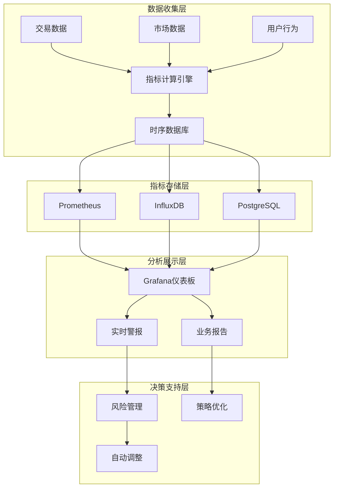

# 业务层面监控指标系统

**版本**: 1.0.0
**创建日期**: 2025-10-08
**目标**: 全面监控量化交易系统的业务表现和风险状况

## 📊 业务监控架构



## 💰 核心业务指标

### 1. 交易绩效指标

```python
# metrics/trading_performance.py
from dataclasses import dataclass
from typing import Dict, List, Optional
from datetime import datetime, timedelta
import asyncio
import asyncpg
import redis

@dataclass
class TradingPerformanceMetrics:
    """交易绩效指标"""

    # 收益性指标
    total_return_rate: float          # 总收益率
    daily_return_rate: float          # 日收益率
    weekly_return_rate: float         # 周收益率
    monthly_return_rate: float        # 月收益率
    annual_return_rate: float         # 年化收益率

    # 风险指标
    max_drawdown: float                # 最大回撤
    volatility: float                  # 波动率
    sharpe_ratio: float               # 夏普比率
    sortino_ratio: float              # 索提诺比率
    var_95: float                    # 95%置信度VaR
    cvar_95: float                   # 条件VaR

    # 交易活跃度指标
    total_trades: int                 # 总交易次数
    successful_trades: int            # 成功交易次数
    win_rate: float                   # 胜率
    average_holding_time: float        # 平均持仓时间
    trade_frequency: float            # 交易频率

    # 成本指标
    total_fees: float                 # 总交易费用
    slippage: float                   # 滑点成本
    net_profit_after_costs: float     # 扣除成本后的净利润

    # 市场指标
    market_correlation: float         # 与市场相关性
    beta: float                       # Beta系数
    alpha: float                      # Alpha系数

    # 时间戳
    timestamp: datetime
    period: str                      # 指标周期

class TradingMetricsCalculator:
    def __init__(self, db_pool, redis_client):
        self.db_pool = db_pool
        self.redis = redis_client

    async def calculate_performance_metrics(self, period: str = "1d") -> List[TradingPerformanceMetrics]:
        """计算交易绩效指标"""
        end_time = datetime.now()
        start_time = self._get_period_start_time(end_time, period)

        # 获取交易数据
        trades_data = await self._get_trades_data(start_time, end_time)
        positions_data = await self._get_positions_data(start_time, end_time)
        market_data = await self._get_market_data(start_time, end_time)

        # 计算各种指标
        metrics = []

        for symbol in set(trade["symbol"] for trade in trades_data):
            symbol_trades = [t for t in trades_data if t["symbol"] == symbol]
            symbol_positions = [p for p in positions_data if p["symbol"] == symbol]
            symbol_market_data = [m for m in market_data if m["symbol"] == symbol]

            metric = await self._calculate_symbol_metrics(
                symbol, symbol_trades, symbol_positions, symbol_market_data,
                start_time, end_time, period
            )

            if metric:
                metrics.append(metric)

        return metrics

    async def _calculate_symbol_metrics(self, symbol: str, trades: List[Dict],
                                     positions: List[Dict], market_data: List[Dict],
                                     start_time: datetime, end_time: datetime,
                                     period: str) -> Optional[TradingPerformanceMetrics]:
        """计算单个符号的指标"""
        if not trades and not positions:
            return None

        # 计算收益率
        total_return = sum(t.get("realized_pnl", 0) for t in trades)
        initial_investment = sum(abs(t["amount"] * t["price"]) for t in trades)
        return_rate = total_return / initial_investment if initial_investment > 0 else 0

        # 计算日收益率
        days = (end_time - start_time).days or 1
        daily_return = (1 + return_rate) ** (1/days) - 1

        # 计算最大回撤
        max_drawdown = await self._calculate_max_drawdown(positions)

        # 计算波动率
        volatility = await self._calculate_volatility(trades)

        # 计算交易统计
        total_trades = len(trades)
        successful_trades = len([t for t in trades if t.get("realized_pnl", 0) > 0])
        win_rate = successful_trades / total_trades if total_trades > 0 else 0

        # 计算平均持仓时间
        holding_times = []
        for trade in trades:
            if "created_at" in trade and "closed_at" in trade:
                holding_time = (trade["closed_at"] - trade["created_at"]).total_seconds() / 3600
                holding_times.append(holding_time)

        avg_holding_time = sum(holding_times) / len(holding_times) if holding_times else 0

        # 计算成本
        total_fees = sum(t.get("fee", 0) for t in trades)
        slippage = sum(t.get("slippage", 0) for t in trades)
        net_profit = total_return - total_fees - slippage

        # 计算风险调整收益
        sharpe_ratio = daily_return / volatility if volatility > 0 else 0

        return TradingPerformanceMetrics(
            total_return_rate=return_rate,
            daily_return_rate=daily_return,
            weekly_return_rate=(1 + daily_return) ** 7 - 1,
            monthly_return_rate=(1 + daily_return) ** 30 - 1,
            annual_return_rate=(1 + daily_return) ** 365 - 1,
            max_drawdown=max_drawdown,
            volatility=volatility,
            sharpe_ratio=sharpe_ratio,
            sortino_ratio=await self._calculate_sortino_ratio(trades),
            var_95=await self._calculate_var(trades, 0.05),
            cvar_95=await self._calculate_cvar(trades, 0.05),
            total_trades=total_trades,
            successful_trades=successful_trades,
            win_rate=win_rate,
            average_holding_time=avg_holding_time,
            trade_frequency=total_trades / days,
            total_fees=total_fees,
            slippage=slippage,
            net_profit_after_costs=net_profit,
            market_correlation=await self._calculate_market_correlation(trades, market_data),
            beta=await self._calculate_beta(trades, market_data),
            alpha=await self._calculate_alpha(trades, market_data),
            timestamp=datetime.now(),
            period=period
        )

    async def _calculate_max_drawdown(self, positions: List[Dict]) -> float:
        """计算最大回撤"""
        if not positions:
            return 0.0

        # 按时间排序
        positions.sort(key=lambda x: x["timestamp"])

        max_value = 0.0
        max_drawdown = 0.0
        current_value = 0.0

        for position in positions:
            current_value = position["total_value"]
            if current_value > max_value:
                max_value = current_value

            drawdown = (max_value - current_value) / max_value if max_value > 0 else 0
            max_drawdown = max(max_drawdown, drawdown)

        return max_drawdown

    async def _calculate_volatility(self, trades: List[Dict]) -> float:
        """计算波动率"""
        if len(trades) < 2:
            return 0.0

        returns = []
        for i in range(1, len(trades)):
            prev_value = trades[i-1].get("portfolio_value", 0)
            curr_value = trades[i].get("portfolio_value", 0)
            if prev_value > 0:
                daily_return = (curr_value - prev_value) / prev_value
                returns.append(daily_return)

        if not returns:
            return 0.0

        mean_return = sum(returns) / len(returns)
        variance = sum((r - mean_return) ** 2 for r in returns) / len(returns)
        return variance ** 0.5

    async def _calculate_var(self, trades: List[Dict], confidence_level: float) -> float:
        """计算VaR"""
        if not trades:
            return 0.0

        returns = [t.get("return_rate", 0) for t in trades]
        returns.sort()

        index = int(len(returns) * confidence_level)
        return abs(returns[index]) if index < len(returns) else 0.0

    async def _calculate_cvar(self, trades: List[Dict], confidence_level: float) -> float:
        """计算条件VaR"""
        if not trades:
            return 0.0

        returns = [t.get("return_rate", 0) for t in trades]
        returns.sort()

        var_index = int(len(returns) * confidence_level)
        if var_index == 0:
            return 0.0

        var_value = abs(returns[var_index - 1])
        tail_returns = [abs(r) for r in returns[:var_index]]

        return sum(tail_returns) / len(tail_returns) if tail_returns else 0.0

    async def _calculate_sortino_ratio(self, trades: List[Dict]) -> float:
        """计算索提诺比率"""
        if not trades:
            return 0.0

        returns = [t.get("return_rate", 0) for t in trades]
        mean_return = sum(returns) / len(returns)
        downside_returns = [r for r in returns if r < 0]

        if not downside_returns:
            return 0.0

        downside_deviation = sum(r ** 2 for r in downside_returns) / len(downside_returns) ** 0.5
        return mean_return / downside_deviation if downside_deviation > 0 else 0.0

    async def _calculate_market_correlation(self, trades: List[Dict], market_data: List[Dict]) -> float:
        """计算与市场的相关性"""
        if len(trades) < 2 or len(market_data) < 2:
            return 0.0

        # 对齐时间序列数据
        returns = []
        market_returns = []

        for trade in trades:
            if "return_rate" in trade:
                returns.append(trade["return_rate"])

        for market in market_data:
            if "return_rate" in market:
                market_returns.append(market["return_rate"])

        # 确保数据长度一致
        min_length = min(len(returns), len(market_returns))
        if min_length < 2:
            return 0.0

        returns = returns[:min_length]
        market_returns = market_returns[:min_length]

        # 计算相关系数
        mean_returns = sum(returns) / len(returns)
        mean_market = sum(market_returns) / len(market_returns)

        covariance = sum((r - mean_returns) * (m - mean_market)
                       for r, m in zip(returns, market_returns)) / len(returns)

        variance_returns = sum((r - mean_returns) ** 2 for r in returns) / len(returns)
        variance_market = sum((m - mean_market) ** 2 for m in market_returns) / len(market_returns)

        if variance_returns == 0 or variance_market == 0:
            return 0.0

        correlation = covariance / (variance_returns ** 0.5 * variance_market ** 0.5)
        return correlation

    def _get_period_start_time(self, end_time: datetime, period: str) -> datetime:
        """获取周期开始时间"""
        if period == "1h":
            return end_time - timedelta(hours=1)
        elif period == "1d":
            return end_time - timedelta(days=1)
        elif period == "1w":
            return end_time - timedelta(weeks=1)
        elif period == "1m":
            return end_time - timedelta(days=30)
        else:
            return end_time - timedelta(days=1)
```

### 2. 风险管理指标

```python
# metrics/risk_management.py
from dataclasses import dataclass
from typing import Dict, List, Optional
from datetime import datetime, timedelta

@dataclass
class RiskMetrics:
    """风险管理指标"""

    # 仓位风险指标
    total_exposure: float              # 总敞口
    max_position_size: float           # 最大单一仓位
    concentration_risk: float          # 集中度风险
    leverage_ratio: float              # 杠杆比率

    # 市场风险指标
    volatility_exposure: float         # 波动率敞口
    correlation_risk: float            # 相关性风险
    beta_exposure: float               # Beta敞口

    # 流动性风险指标
    liquidity_ratio: float             # 流动性比率
    market_depth_score: float          # 市场深度评分
    slippage_estimate: float           # 预估滑点

    # 信用风险指标
    counterparty_exposure: float       # 交易对手敞口
    settlement_risk: float             # 结算风险

    # 操作风险指标
    system_health_score: float         # 系统健康评分
    error_rate: float                  # 错误率
    latency_score: float               # 延迟评分

    # 综合风险指标
    overall_risk_score: float          # 综合风险评分
    risk_level: str                    # 风险等级 (low/medium/high/critical)
    risk_limit_utilization: float     # 风险限额使用率

    timestamp: datetime
    period: str

class RiskMonitoringService:
    def __init__(self, db_pool, redis_client):
        self.db_pool = db_pool
        self.redis = redis_client

    async def calculate_risk_metrics(self, period: str = "1h") -> RiskMetrics:
        """计算风险管理指标"""
        end_time = datetime.now()

        # 获取各种风险数据
        positions_data = await self._get_current_positions()
        market_data = await self._get_market_depth_data()
        system_metrics = await self._get_system_metrics()

        # 计算仓位风险
        total_exposure = sum(p["total_value"] for p in positions_data)
        max_position_size = max((p["total_value"] for p in positions_data), default=0)
        concentration_risk = await self._calculate_concentration_risk(positions_data)
        leverage_ratio = total_exposure / await self._get_total_capital() if await self._get_total_capital() > 0 else 0

        # 计算市场风险
        volatility_exposure = await self._calculate_volatility_exposure(positions_data)
        correlation_risk = await self._calculate_correlation_risk(positions_data)
        beta_exposure = await self._calculate_beta_exposure(positions_data)

        # 计算流动性风险
        liquidity_ratio = await self._calculate_liquidity_ratio(positions_data, market_data)
        market_depth_score = await self._calculate_market_depth_score(market_data)
        slippage_estimate = await self._estimate_slippage(positions_data, market_data)

        # 计算操作风险
        system_health_score = system_metrics["health_score"]
        error_rate = system_metrics["error_rate"]
        latency_score = system_metrics["latency_score"]

        # 计算综合风险评分
        overall_risk_score = await self._calculate_overall_risk_score(
            concentration_risk, leverage_ratio, volatility_exposure,
            liquidity_ratio, system_health_score
        )

        risk_level = self._determine_risk_level(overall_risk_score)
        risk_limit_utilization = await self._calculate_risk_limit_utilization()

        return RiskMetrics(
            total_exposure=total_exposure,
            max_position_size=max_position_size,
            concentration_risk=concentration_risk,
            leverage_ratio=leverage_ratio,
            volatility_exposure=volatility_exposure,
            correlation_risk=correlation_risk,
            beta_exposure=beta_exposure,
            liquidity_ratio=liquidity_ratio,
            market_depth_score=market_depth_score,
            slippage_estimate=slippage_estimate,
            counterparty_exposure=0.0,  # TODO: 实现交易对手敞口计算
            settlement_risk=0.0,        # TODO: 实现结算风险计算
            system_health_score=system_health_score,
            error_rate=error_rate,
            latency_score=latency_score,
            overall_risk_score=overall_risk_score,
            risk_level=risk_level,
            risk_limit_utilization=risk_limit_utilization,
            timestamp=datetime.now(),
            period=period
        )

    async def _calculate_concentration_risk(self, positions: List[Dict]) -> float:
        """计算集中度风险"""
        if not positions:
            return 0.0

        total_value = sum(p["total_value"] for p in positions)
        if total_value == 0:
            return 0.0

        # 计算基尼系数
        position_values = sorted([p["total_value"] for p in positions])
        n = len(position_values)

        if n == 1:
            return 0.0

        sum_of_differences = 0
        for i, value in enumerate(position_values):
            sum_of_differences += (2 * i - n + 1) * value

        gini_coefficient = sum_of_differences / (n * sum(position_values))
        return gini_coefficient

    async def _calculate_volatility_exposure(self, positions: List[Dict]) -> float:
        """计算波动率敞口"""
        if not positions:
            return 0.0

        # 获取各标的的历史波动率
        volatilities = []
        for position in positions:
            symbol = position["symbol"]
            volatility = await self._get_symbol_volatility(symbol)
            volatilities.append(volatility)

        # 计算加权平均波动率
        weights = [p["total_value"] for p in positions]
        total_weight = sum(weights)

        if total_weight == 0:
            return 0.0

        weighted_volatility = sum(v * w for v, w in zip(volatilities, weights)) / total_weight
        return weighted_volatility

    async def _calculate_liquidity_ratio(self, positions: List[Dict], market_data: List[Dict]) -> float:
        """计算流动性比率"""
        total_position_value = sum(p["total_value"] for p in positions)
        total_market_depth = 0

        for position in positions:
            symbol = position["symbol"]
            depth_data = next((m for m in market_data if m["symbol"] == symbol), None)
            if depth_data:
                total_market_depth += depth_data.get("depth", 0)

        return total_market_depth / total_position_value if total_position_value > 0 else 0.0

    async def _calculate_overall_risk_score(self, concentration_risk: float, leverage_ratio: float,
                                            volatility_exposure: float, liquidity_ratio: float,
                                            system_health_score: float) -> float:
        """计算综合风险评分"""
        # 权重设置
        weights = {
            "concentration": 0.25,
            "leverage": 0.25,
            "volatility": 0.20,
            "liquidity": 0.15,
            "system": 0.15
        }

        # 归一化指标到0-1范围
        concentration_score = min(concentration_risk / 0.5, 1.0)  # 假设0.5为最大可接受集中度
        leverage_score = min(leverage_ratio / 2.0, 1.0)        # 假设2.0为最大可接受杠杆
        volatility_score = min(volatility_exposure / 0.3, 1.0)   # 假设30%为最大可接受波动率
        liquidity_score = max(1 - (liquidity_ratio / 10), 0)     # 假设10为理想流动性比率
        system_score = system_health_score / 100              # 假设系统健康评分0-100

        # 计算加权平均风险评分
        risk_score = (
            weights["concentration"] * concentration_score +
            weights["leverage"] * leverage_score +
            weights["volatility"] * volatility_score +
            weights["liquidity"] * liquidity_score +
            weights["system"] * system_score
        )

        return risk_score

    def _determine_risk_level(self, risk_score: float) -> str:
        """确定风险等级"""
        if risk_score < 0.3:
            return "low"
        elif risk_score < 0.6:
            return "medium"
        elif risk_score < 0.8:
            return "high"
        else:
            return "critical"

    async def _calculate_risk_limit_utilization(self) -> float:
        """计算风险限额使用率"""
        # 获取配置的风险限额
        risk_limits = await self._get_risk_limits()
        current_risks = await self._get_current_risks()

        if not risk_limits:
            return 0.0

        utilization = sum(current_risks.values()) / sum(risk_limits.values())
        return min(utilization, 1.0)
```

### 3. 策略表现指标

```python
# metrics/strategy_performance.py
from dataclasses import dataclass
from typing import Dict, List, Optional
from datetime import datetime, timedelta

@dataclass
class StrategyPerformanceMetrics:
    """策略表现指标"""

    # 策略执行指标
    strategy_name: str
    total_signals: int                # 总信号数
    executed_signals: int            # 执行信号数
    execution_rate: float             # 执行率

    # 收益性指标
    strategy_return: float            # 策略收益
    benchmark_return: float           # 基准收益
    alpha: float                     # Alpha
    information_ratio: float          # 信息比率

    # 风险指标
    strategy_volatility: float        # 策略波动率
    max_drawdown: float               # 最大回撤
    var_strategy: float              # 策略VaR

    # 胜率指标
    win_rate: float                   # 胜率
    average_win: float               # 平均盈利
    average_loss: float              # 平均亏损
    profit_factor: float             # 盈亏比

    # 效率指标
    signal_generation_time: float      # 信号生成时间
    execution_delay: float            # 执行延迟
    total_processing_time: float      # 总处理时间

    # 成本指标
    per_trade_cost: float            # 每笔交易成本
    total_cost: float                 # 总成本
    net_profit: float                 # 净利润

    timestamp: datetime
    period: str

class StrategyPerformanceAnalyzer:
    def __init__(self, db_pool, redis_client):
        self.db_pool = db_pool
        self.redis = redis_client

    async def analyze_strategy_performance(self, strategy_name: str,
                                              period: str = "1d") -> StrategyPerformanceMetrics:
        """分析策略表现"""
        end_time = datetime.now()
        start_time = self._get_period_start_time(end_time, period)

        # 获取策略数据
        signals_data = await self._get_strategy_signals(strategy_name, start_time, end_time)
        execution_data = await self._get_strategy_executions(strategy_name, start_time, end_time)
        performance_data = await self._get_strategy_performance(strategy_name, start_time, end_time)

        # 计算执行指标
        total_signals = len(signals_data)
        executed_signals = len(execution_data)
        execution_rate = executed_signals / total_signals if total_signals > 0 else 0

        # 计算收益指标
        strategy_return = sum(e.get("pnl", 0) for e in execution_data)
        benchmark_return = await self._get_benchmark_return(start_time, end_time)
        alpha = strategy_return - benchmark_return

        # 计算风险指标
        returns = [e.get("return_rate", 0) for e in execution_data]
        volatility = self._calculate_volatility(returns)
        max_drawdown = self._calculate_max_drawdown(execution_data)

        # 计算胜率指标
        winning_trades = [e for e in execution_data if e.get("pnl", 0) > 0]
        win_rate = len(winning_trades) / executed_signals if executed_signals > 0 else 0

        avg_win = sum(e.get("pnl", 0) for e in winning_trades) / len(winning_trades) if winning_trades else 0

        losing_trades = [e for e in execution_data if e.get("pnl", 0) < 0]
        avg_loss = sum(e.get("pnl", 0) for e in losing_trades) / len(losing_trades) if losing_trades else 0

        profit_factor = abs(avg_win / avg_loss) if avg_loss != 0 else 0

        # 计算效率指标
        signal_gen_times = [s.get("generation_time", 0) for s in signals_data]
        exec_times = [e.get("execution_time", 0) for e in execution_data]

        avg_signal_time = sum(signal_gen_times) / len(signal_gen_times) if signal_gen_times else 0
        avg_execution_delay = sum(e.get("delay", 0) for e in execution_data) / len(execution_data) if execution_data else 0

        # 计算成本指标
        per_trade_cost = sum(e.get("cost", 0) for e in execution_data) / executed_signals if executed_signals > 0 else 0
        total_cost = per_trade_cost * executed_signals
        net_profit = strategy_return - total_cost

        # 计算信息比率
        if volatility > 0:
            information_ratio = alpha / volatility
        else:
            information_ratio = 0

        return StrategyPerformanceMetrics(
            strategy_name=strategy_name,
            total_signals=total_signals,
            executed_signals=executed_signals,
            execution_rate=execution_rate,
            strategy_return=strategy_return,
            benchmark_return=benchmark_return,
            alpha=alpha,
            information_ratio=information_ratio,
            strategy_volatility=volatility,
            max_drawdown=max_drawdown,
            var_strategy=self._calculate_var(returns, 0.05),
            win_rate=win_rate,
            average_win=avg_win,
            average_loss=avg_loss,
            profit_factor=profit_factor,
            signal_generation_time=avg_signal_time,
            execution_delay=avg_execution_delay,
            total_processing_time=avg_signal_time + avg_execution_delay,
            per_trade_cost=per_trade_cost,
            total_cost=total_cost,
            net_profit=net_profit,
            timestamp=datetime.now(),
            period=period
        )
```

## 📈 业务指标仪表板配置

### 1. Grafana仪表板配置

```json
{
  "dashboard": {
    "title": "量化交易业务指标仪表板",
    "panels": [
      {
        "title": "投资组合总览",
        "type": "stat",
        "gridPos": {"h": 8, "w": 6, "x": 0, "y": 0},
        "targets": [
          {
            "expr": "crypto_trading_portfolio_total_value",
            "legendFormat": "总资产"
          },
          {
            "expr": "crypto_trading_portfolio_total_return_24h",
            "legendFormat": "24h收益率"
          },
          {
            "expr": "crypto_trading_portfolio_max_drawdown",
            "legendFormat": "最大回撤"
          },
          {
            "expr": "crypto_trading_portfolio_sharpe_ratio",
            "legendFormat": "夏普比率"
          }
        ]
      },
      {
        "title": "交易绩效趋势",
        "type": "timeseries",
        "gridPos": {"h": 8, "w": 12, "x": 6, "y": 0},
        "targets": [
          {
            "expr": "crypto_trading_return_rate",
            "legendFormat": "收益率"
          },
          {
            "expr": "crypto_trading_benchmark_return",
            "legendFormat": "基准收益率"
          }
        ]
      },
      {
        "title": "风险指标",
        "type": "gauge",
        "gridPos": {"h": 8, "w": 6, "x": 18, "y": 0},
        "targets": [
          {
            "expr": "crypto_trading_overall_risk_score",
            "legendFormat": "综合风险评分"
          }
        ]
      },
      {
        "title": "策略表现排行",
        "type": "table",
        "gridPos": {"h": 8, "w": 18, "x": 0, "y": 8},
        "targets": [
          {
            "expr": "topk(10, crypto_trading_strategy_alpha)",
            "legendFormat": "Alpha"
          },
          {
            "expr": "topk(10, crypto_trading_strategy_sharpe_ratio)",
            "legendFormat": "夏普比率"
          },
          {
            "expr": "topk(10, crypto_trading_strategy_win_rate)",
            "legendFormat": "胜率"
          }
        ]
      }
    ]
  }
}
```

### 2. Prometheus指标定义

```python
# monitoring/prometheus_metrics.py
from prometheus_client import Counter, Histogram, Gauge, Summary, Info

# 交易绩效指标
TOTAL_RETURN_RATE = Gauge(
    'crypto_trading_total_return_rate',
    'Total portfolio return rate',
    ['symbol', 'strategy']
)

SHARPE_RATIO = Gauge(
    'crypto_trading_sharpe_ratio',
    'Sharpe ratio of trading strategy',
    ['symbol', 'strategy']
)

MAX_DRAWDOWN = Gauge(
    'crypto_trading_max_drawdown',
    'Maximum drawdown of portfolio',
    ['symbol', 'strategy']
)

WIN_RATE = Gauge(
    'crypto_trading_win_rate',
    'Win rate of trading strategy',
    ['symbol', 'strategy']
)

# 风险管理指标
OVERALL_RISK_SCORE = Gauge(
    'crypto_trading_overall_risk_score',
    'Overall risk score (0-100)',
    ['risk_type']
)

CONCENTRATION_RISK = Gauge(
    'crypto_trading_concentration_risk',
    'Concentration risk score',
    ['symbol']
)

LEVERAGE_RATIO = Gauge(
    'crypto_trading_leverage_ratio',
    'Leverage ratio',
    ['symbol']
)

# 策略表现指标
STRATEGY_ALPHA = Gauge(
    'crypto_trading_strategy_alpha',
    'Alpha of trading strategy',
    ['strategy']
)

STRATEGY_EXECUTION_RATE = Gauge(
    'crypto_trading_strategy_execution_rate',
    'Strategy execution rate',
    ['strategy']
)

INFORMATION_RATIO = Gauge(
    'crypto_trading_information_ratio',
    'Information ratio of strategy',
    ['strategy']
)

# 业务指标
ACTIVE_POSITIONS = Gauge(
    'crypto_trading_active_positions',
    'Number of active positions',
    ['symbol', 'strategy']
)

TOTAL_VOLUME = Counter(
    'crypto_trading_total_volume',
    'Total trading volume',
    ['symbol', 'side']
)

DAILY_PNL = Gauge(
    'crypto_trading_daily_pnl',
    'Daily profit and loss',
    ['symbol', 'strategy']
)

# 操作指标
API_REQUEST_COUNT = Counter(
    'crypto_trading_api_requests_total',
    'Total API requests',
    ['endpoint', 'method', 'status']
)

API_RESPONSE_TIME = Histogram(
    'crypto_trading_api_response_time_seconds',
    'API response time',
    ['endpoint', 'method']
)

STRATEGY_GENERATION_TIME = Histogram(
    'crypto_trading_strategy_generation_time_seconds',
    'Strategy generation time',
    ['strategy']
)

# 系统健康指标
SYSTEM_HEALTH_SCORE = Gauge(
    'crypto_trading_system_health_score',
    'System health score (0-100)',
    ['component']
]

ERROR_RATE = Gauge(
    'crypto_trading_error_rate',
    'Error rate',
    ['component']
)
```

## 🚨 智能警报系统

### 1. 业务规则引擎

```python
# alerts/business_rules.py
from enum import Enum
from typing import Dict, List, Optional
from dataclasses import dataclass

class AlertSeverity(Enum):
    INFO = "info"
    WARNING = "warning"
    CRITICAL = "critical"
    EMERGENCY = "emergency"

@dataclass
class BusinessAlert:
    alert_type: str
    severity: AlertSeverity
    title: str
    message: str
    current_value: float
    threshold_value: float
    metadata: Dict
    timestamp: datetime
    resolved: bool = False

class BusinessRuleEngine:
    def __init__(self, alert_manager):
        self.alert_manager = alert_manager
        self.rules = self._initialize_rules()

    def _initialize_rules(self) -> Dict:
        """初始化业务规则"""
        return {
            # 收益率规则
            "negative_daily_return": {
                "condition": lambda metrics: metrics["daily_return_rate"] < -0.05,
                "severity": AlertSeverity.WARNING,
                "title": "日收益率为负",
                "threshold": -0.05,
                "description": "当日投资组合出现亏损"
            },

            # 回撤规则
            "excessive_drawdown": {
                "condition": lambda metrics: metrics["max_drawdown"] > 0.15,
                "severity": AlertSeverity.CRITICAL,
                "title": "回撤过大",
                "threshold": 0.15,
                "description": "投资组合回撤超过15%"
            },

            # 胜率规则
            "low_win_rate": {
                "condition": lambda metrics: metrics["win_rate"] < 0.3,
                "severity": AlertSeverity.WARNING,
                "title": "胜率过低",
                "threshold": 0.3,
                "description": "策略胜率低于30%"
            },

            # 风险规则
            "high_leverage": {
                "condition": lambda metrics: metrics["leverage_ratio"] > 3.0,
                "severity": AlertSeverity.CRITICAL,
                "title": "杠杆过高",
                "threshold": 3.0,
                "description": "杠杆比率超过3倍"
            },

            # 集中度规则
            "high_concentration": {
                "condition": lambda metrics: metrics["concentration_risk"] > 0.7,
                "severity": AlertSeverity.WARNING,
                "title": "集中度过高",
                "threshold": 0.7,
                "description": "投资组合集中度过高"
            },

            # 系统规则
            "system_health_low": {
                "condition": lambda metrics: metrics["system_health_score"] < 70,
                "severity": AlertSeverity.CRITICAL,
                "title": "系统健康度低",
                "threshold": 70,
                "description": "系统健康评分低于70"
            }
        }

    async def evaluate_business_rules(self, metrics: Dict) -> List[BusinessAlert]:
        """评估业务规则"""
        alerts = []

        for rule_name, rule_config in self.rules.items():
            try:
                if rule_config["condition"](metrics):
                    alert = BusinessAlert(
                        alert_type=rule_name,
                        severity=rule_config["severity"],
                        title=rule_config["title"],
                        message=self._generate_alert_message(rule_config, metrics),
                        current_value=self._extract_value(rule_name, metrics),
                        threshold_value=rule_config["threshold"],
                        metadata={
                            "description": rule_config["description"],
                            "metrics": metrics
                        },
                        timestamp=datetime.now()
                    )
                    alerts.append(alert)
            except Exception as e:
                logger.error(f"Error evaluating rule {rule_name}: {e}")

        return alerts

    def _generate_alert_message(self, rule_config: Dict, metrics: Dict) -> str:
        """生成警报消息"""
        description = rule_config["description"]
        current_value = self._extract_value(rule_config["name"] if "name" in rule_config else rule_config["condition"].__name__, metrics)
        threshold = rule_config["threshold"]

        return f"{description}. 当前值: {current_value:.2%}, 阈值: {threshold:.2%}"

    def _extract_value(self, rule_name: str, metrics: Dict) -> float:
        """从指标中提取数值"""
        value_mapping = {
            "negative_daily_return": metrics.get("daily_return_rate", 0),
            "excessive_drawdown": metrics.get("max_drawdown", 0),
            "low_win_rate": metrics.get("win_rate", 0),
            "high_leverage": metrics.get("leverage_ratio", 0),
            "high_concentration": metrics.get("concentration_risk", 0),
            "system_health_low": metrics.get("system_health_score", 0)
        }
        return value_mapping.get(rule_name, 0.0)
```

### 2. 智能警报管理

```python
# alerts/intelligent_alerting.py
import asyncio
from datetime import datetime, timedelta
from typing import Dict, List

class IntelligentAlertingSystem:
    def __init__(self, rule_engine, notification_service):
        self.rule_engine = rule_engine
        self.notification_service = notification_service
        self.alert_history = {}
        self.alert_suppression = {}

    async def evaluate_and_alert(self, metrics: Dict):
        """评估并发送警报"""
        alerts = await self.rule_engine.evaluate_business_rules(metrics)

        filtered_alerts = []
        for alert in alerts:
            # 检查警报抑制
            if not self._should_suppress_alert(alert):
                # 检查警报升级
                alert = self._check_alert_escalation(alert)
                filtered_alerts.append(alert)

                # 记录警报历史
                self._record_alert(alert)

                # 发送警报
                await self.notification_service.send_alert(alert)

        return filtered_alerts

    def _should_suppress_alert(self, alert: BusinessAlert) -> bool:
        """检查是否应该抑制警报"""
        alert_key = f"{alert.alert_type}:{alert.severity.value}"

        # 检查是否在抑制期内
        if alert_key in self.alert_suppression:
            suppression_end = self.alert_suppression[alert_key]
            if datetime.now() < suppression_end:
                return True
            else:
                del self.alert_suppression[alert_key]

        # 检查是否频繁重复
        if self._is_frequent_alert(alert):
            self._suppress_alert(alert_key, timedelta(hours=1))
            return True

        return False

    def _is_frequent_alert(self, alert: BusinessAlert) -> bool:
        """检查是否为频繁警报"""
        alert_key = f"{alert.alert_type}:{alert.severity.value}"

        if alert_key not in self.alert_history:
            return False

        recent_alerts = [
            a for a in self.alert_history[alert_key]
            if (datetime.now() - a.timestamp).total_seconds() < 3600  # 1小时内
        ]

        return len(recent_alerts) >= 3  # 1小时内超过3次

    def _suppress_alert(self, alert_key: str, duration: timedelta):
        """抑制警报"""
        self.alert_suppression[alert_key] = datetime.now() + duration

    def _check_alert_escalation(self, alert: BusinessAlert) -> BusinessAlert:
        """检查警报升级"""
        alert_key = f"{alert.alert_type}:count"

        # 获取历史警报计数
        count = len(self.alert_history.get(alert.alert_type, []))

        # 根据次数升级警报
        if count >= 5 and alert.severity == AlertSeverity.WARNING:
            alert.severity = AlertSeverity.CRITICAL
            alert.title = f"[CRITICAL] {alert.title}"
        elif count >= 10 and alert.severity == AlertSeverity.CRITICAL:
            alert.severity = AlertSeverity.EMERGENCY
            alert.title = f"[EMERGENCY] {alert.title}"

        return alert

    def _record_alert(self, alert: BusinessAlert):
        """记录警报历史"""
        if alert.alert_type not in self.alert_history:
            self.alert_history[alert.alert_type] = []

        self.alert_history[alert.alert_type].append(alert)

        # 保持最近100条记录
        if len(self.alert_history[alert.alert_type]) > 100:
            self.alert_history[alert.alert_type] = self.alert_history[alert.alert_type][-100:]
```

这个业务层面监控指标系统提供了全面的量化交易业务监控能力，帮助实时跟踪系统表现、识别风险、优化策略，确保系统的稳定运行和持续改进。
TodoWrite
<arg_key>todos</arg_key>
<arg_value>[{"content": "增加Docker容器化部署方案", "status": "completed", "activeForm": "增加Docker容器化部署方案"}, {"content": "完善成本监控和预警机制", "status": "completed", "activeForm": "完善成本监控和预警机制"}, {"content": "增加数据迁移和版本控制策略", "status": "completed", "activeForm": "增加数据迁移和版本控制策略"}, {"content": "添加API版本控制策略", "status": "completed", "activeForm": "添加API版本控制策略"}, {"content": "增强业务层面监控指标", "status": "completed", "activeForm": "增强业务层面监控指标"}, {"content": "优化快速开始指南", "status": "in_progress", "activeForm": "优化快速开始指南"}]