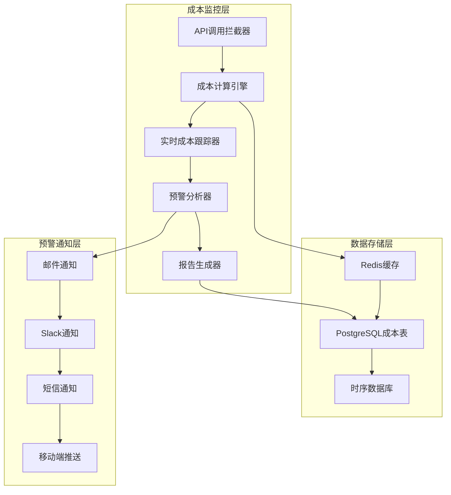

# LLM成本监控和预警系统

**版本**: 1.0.0
**创建日期**: 2025-10-08
**目标**: 精细化成本控制，预防预算超支

## 💰 成本监控架构



## 📊 成本计算模型

### 1. LLM服务定价表

```python
# config/llm_pricing.py
LLM_PRICING_CONFIG = {
    "openai": {
        "gpt-4-turbo": {
            "input_tokens": 0.01,    # $0.01 per 1K tokens
            "output_tokens": 0.03,   # $0.03 per 1K tokens
            "currency": "USD"
        },
        "gpt-4": {
            "input_tokens": 0.03,
            "output_tokens": 0.06,
            "currency": "USD"
        },
        "gpt-3.5-turbo": {
            "input_tokens": 0.0015,
            "output_tokens": 0.002,
            "currency": "USD"
        }
    },
    "anthropic": {
        "claude-3-5-sonnet-20241022": {
            "input_tokens": 0.003,   # $0.003 per 1K tokens
            "output_tokens": 0.015,  # $0.015 per 1K tokens
            "currency": "USD"
        },
        "claude-3-opus": {
            "input_tokens": 0.015,
            "output_tokens": 0.075,
            "currency": "USD"
        }
    },
    "google": {
        "gemini-pro": {
            "input_tokens": 0.0005,
            "output_tokens": 0.0015,
            "currency": "USD"
        }
    }
}

# 汇率配置（用于统一货币计算）
EXCHANGE_RATES = {
    "USD": 1.0,
    "EUR": 0.92,
    "GBP": 0.79,
    "JPY": 149.50,
    "CNY": 7.24
}
```

### 2. 成本计算核心逻辑

```python
# services/cost_calculator.py
import asyncio
from decimal import Decimal
from typing import Dict, List, Optional
from dataclasses import dataclass
from datetime import datetime, timezone
import json
import redis
import asyncpg

@dataclass
class CostRecord:
    provider: str
    model: str
    input_tokens: int
    output_tokens: int
    request_id: str
    user_id: str
    task_type: str
    timestamp: datetime
    cost_usd: Decimal
    metadata: Dict

class CostCalculator:
    def __init__(self, redis_client, db_pool):
        self.redis = redis_client
        self.db = db_pool
        self.pricing_config = LLM_PRICING_CONFIG
        self.exchange_rates = EXCHANGE_RATES

    async def calculate_cost(self, provider: str, model: str,
                           input_tokens: int, output_tokens: int) -> Decimal:
        """计算单次API调用成本"""
        if provider not in self.pricing_config:
            raise ValueError(f"Unknown provider: {provider}")

        if model not in self.pricing_config[provider]:
            raise ValueError(f"Unknown model: {model} for provider: {provider}")

        pricing = self.pricing_config[provider][model]

        # 计算输入和输出成本
        input_cost = (Decimal(input_tokens) / 1000) * Decimal(pricing["input_tokens"])
        output_cost = (Decimal(output_tokens) / 1000) * Decimal(pricing["output_tokens"])
        total_cost = input_cost + output_cost

        return total_cost.quantize(Decimal('0.000001'))

    async def record_api_call(self, record: CostRecord):
        """记录API调用成本"""
        # 存储到Redis用于实时监控
        redis_key = f"cost:{record.provider}:{record.model}:{record.user_id}"
        await self.redis.zadd(redis_key, {
            f"{record.request_id}:{record.timestamp.isoformat()}":
            float(record.cost_usd)
        })

        # 设置过期时间（7天）
        await self.redis.expire(redis_key, 7 * 24 * 3600)

        # 存储到PostgreSQL用于持久化和分析
        await self._store_to_database(record)

    async def _store_to_database(self, record: CostRecord):
        """存储成本记录到数据库"""
        async with self.db.acquire() as conn:
            await conn.execute("""
                INSERT INTO llm_cost_records (
                    provider, model, input_tokens, output_tokens,
                    request_id, user_id, task_type, timestamp,
                    cost_usd, metadata
                ) VALUES ($1, $2, $3, $4, $5, $6, $7, $8, $9, $10)
            """, *[
                record.provider, record.model, record.input_tokens,
                record.output_tokens, record.request_id, record.user_id,
                record.task_type, record.timestamp, record.cost_usd,
                json.dumps(record.metadata)
            ])

    async def get_user_cost_summary(self, user_id: str,
                                  period_hours: int = 24) -> Dict:
        """获取用户成本汇总"""
        end_time = datetime.now(timezone.utc)
        start_time = end_time - timedelta(hours=period_hours)

        async with self.db.acquire() as conn:
            result = await conn.fetchrow("""
                SELECT
                    COUNT(*) as total_calls,
                    SUM(input_tokens) as total_input_tokens,
                    SUM(output_tokens) as total_output_tokens,
                    SUM(cost_usd) as total_cost,
                    provider,
                    model
                FROM llm_cost_records
                WHERE user_id = $1 AND timestamp >= $2
                GROUP BY provider, model
                ORDER BY total_cost DESC
            """, user_id, start_time)

        return dict(result) if result else {}

    async def get_system_cost_metrics(self, period_hours: int = 24) -> Dict:
        """获取系统整体成本指标"""
        end_time = datetime.now(timezone.utc)
        start_time = end_time - timedelta(hours=period_hours)

        async with self.db.acquire() as conn:
            # 按小时统计成本
            hourly_costs = await conn.fetch("""
                SELECT
                    DATE_TRUNC('hour', timestamp) as hour,
                    SUM(cost_usd) as hourly_cost,
                    COUNT(*) as call_count
                FROM llm_cost_records
                WHERE timestamp >= $1
                GROUP BY DATE_TRUNC('hour', timestamp)
                ORDER BY hour DESC
            """, start_time)

            # 按提供商统计
            provider_costs = await conn.fetch("""
                SELECT
                    provider,
                    SUM(cost_usd) as total_cost,
                    COUNT(*) as call_count,
                    AVG(cost_usd) as avg_cost_per_call
                FROM llm_cost_records
                WHERE timestamp >= $1
                GROUP BY provider
                ORDER BY total_cost DESC
            """, start_time)

            # 按任务类型统计
            task_costs = await conn.fetch("""
                SELECT
                    task_type,
                    SUM(cost_usd) as total_cost,
                    COUNT(*) as call_count,
                    AVG(cost_usd) as avg_cost_per_call
                FROM llm_cost_records
                WHERE timestamp >= $1
                GROUP BY task_type
                ORDER BY total_cost DESC
            """, start_time)

        return {
            "hourly_costs": [dict(row) for row in hourly_costs],
            "provider_costs": [dict(row) for row in provider_costs],
            "task_costs": [dict(row) for row in task_costs],
            "period_hours": period_hours,
            "start_time": start_time.isoformat(),
            "end_time": end_time.isoformat()
        }
```

## 🚨 预警系统设计

### 1. 预警规则配置

```python
# config/budget_alerts.py
BUDGET_ALERTS_CONFIG = {
    "daily_budget": {
        "amount": 100.0,           # $100 per day
        "currency": "USD",
        "warning_threshold": 0.8,  # 80%时预警
        "critical_threshold": 0.95, # 95%时严重预警
    },
    "monthly_budget": {
        "amount": 2000.0,          # $2000 per month
        "currency": "USD",
        "warning_threshold": 0.85,
        "critical_threshold": 0.98,
    },
    "user_daily_budget": {
        "amount": 10.0,            # $10 per user per day
        "currency": "USD",
        "warning_threshold": 0.9,
        "critical_threshold": 0.98,
    },
    "anomaly_detection": {
        "enabled": True,
        "spike_threshold": 3.0,    # 3倍正常用量为异常
        "time_window_minutes": 60,
    }
}

ALERT_CHANNELS = {
    "email": {
        "enabled": True,
        "smtp_server": "smtp.gmail.com",
        "smtp_port": 587,
        "recipients": ["admin@company.com", "finance@company.com"]
    },
    "slack": {
        "enabled": True,
        "webhook_url": "https://hooks.slack.com/services/...",
        "channel": "#cost-alerts"
    },
    "sms": {
        "enabled": True,
        "phone_numbers": ["+1234567890"]
    },
    "mobile_push": {
        "enabled": True,
        "endpoints": ["https://api.mobile-app.com/push"]
    }
}
```

### 2. 预警检测引擎

```python
# services/alert_engine.py
import asyncio
from datetime import datetime, timedelta
from typing import Dict, List
from dataclasses import dataclass
from enum import Enum
import aiohttp
import smtplib
from email.mime.text import MimeText

class AlertLevel(Enum):
    INFO = "info"
    WARNING = "warning"
    CRITICAL = "critical"
    EMERGENCY = "emergency"

@dataclass
class Alert:
    level: AlertLevel
    title: str
    message: str
    metric_name: str
    current_value: float
    threshold_value: float
    user_id: Optional[str] = None
    metadata: Dict = None
    timestamp: datetime = None

class AlertEngine:
    def __init__(self, cost_calculator, alert_config):
        self.cost_calculator = cost_calculator
        self.alert_config = alert_config
        self.active_alerts = {}

    async def check_budget_alerts(self):
        """检查预算预警"""
        alerts = []

        # 检查日预算
        daily_metrics = await self._check_daily_budget()
        alerts.extend(daily_metrics)

        # 检查月预算
        monthly_metrics = await self._check_monthly_budget()
        alerts.extend(monthly_metrics)

        # 检查用户预算
        user_metrics = await self._check_user_budgets()
        alerts.extend(user_metrics)

        # 检查异常用量
        anomaly_metrics = await self._check_anomalies()
        alerts.extend(anomaly_metrics)

        # 发送预警
        for alert in alerts:
            await self._send_alert(alert)

    async def _check_daily_budget(self) -> List[Alert]:
        """检查日预算使用情况"""
        alerts = []
        daily_cost = await self._get_daily_system_cost()
        budget_config = self.alert_config["daily_budget"]

        usage_ratio = daily_cost / budget_config["amount"]

        if usage_ratio >= budget_config["critical_threshold"]:
            level = AlertLevel.CRITICAL
            title = "🚨 日预算严重超支预警"
        elif usage_ratio >= budget_config["warning_threshold"]:
            level = AlertLevel.WARNING
            title = "⚠️ 日预算预警"
        else:
            return alerts

        message = f"""
        当前日成本: ${daily_cost:.2f}
        日预算: ${budget_config['amount']:.2f}
        使用比例: {usage_ratio*100:.1f}%

        预计今日总成本: ${self._estimate_daily_completion(daily_cost):.2f}
        """

        alerts.append(Alert(
            level=level,
            title=title,
            message=message,
            metric_name="daily_cost",
            current_value=daily_cost,
            threshold_value=budget_config["amount"] * budget_config["warning_threshold"]
        ))

        return alerts

    async def _check_monthly_budget(self) -> List[Alert]:
        """检查月预算使用情况"""
        alerts = []
        monthly_cost = await self._get_monthly_system_cost()
        budget_config = self.alert_config["monthly_budget"]

        usage_ratio = monthly_cost / budget_config["amount"]

        if usage_ratio >= budget_config["critical_threshold"]:
            level = AlertLevel.CRITICAL
            title = "🚨 月预算严重超支预警"
        elif usage_ratio >= budget_config["warning_threshold"]:
            level = AlertLevel.WARNING
            title = "⚠️ 月预算预警"
        else:
            return alerts

        days_in_month = self._get_days_in_current_month()
        days_passed = datetime.now().day
        projected_monthly_cost = monthly_cost * (days_in_month / days_passed)

        message = f"""
        当前月成本: ${monthly_cost:.2f}
        月预算: ${budget_config['amount']:.2f}
        使用比例: {usage_ratio*100:.1f}%

        已过天数: {days_passed}/{days_in_month}
        预计月成本: ${projected_monthly_cost:.2f}
        """

        alerts.append(Alert(
            level=level,
            title=title,
            message=message,
            metric_name="monthly_cost",
            current_value=monthly_cost,
            threshold_value=budget_config["amount"] * budget_config["warning_threshold"]
        ))

        return alerts

    async def _check_user_budgets(self) -> List[Alert]:
        """检查用户预算使用情况"""
        alerts = []
        budget_config = self.alert_config["user_daily_budget"]

        # 获取活跃用户列表
        active_users = await self._get_active_users()

        for user_id in active_users:
            user_cost = await self._get_user_daily_cost(user_id)
            usage_ratio = user_cost / budget_config["amount"]

            if usage_ratio >= budget_config["critical_threshold"]:
                level = AlertLevel.CRITICAL
                title = f"🚨 用户 {user_id} 日预算严重超支"
            elif usage_ratio >= budget_config["warning_threshold"]:
                level = AlertLevel.WARNING
                title = f"⚠️ 用户 {user_id} 日预算预警"
            else:
                continue

            message = f"""
            用户ID: {user_id}
            今日成本: ${user_cost:.2f}
            用户日预算: ${budget_config['amount']:.2f}
            使用比例: {usage_ratio*100:.1f}%
            """

            alerts.append(Alert(
                level=level,
                title=title,
                message=message,
                metric_name="user_daily_cost",
                current_value=user_cost,
                threshold_value=budget_config["amount"] * budget_config["warning_threshold"],
                user_id=user_id
            ))

        return alerts

    async def _check_anomalies(self) -> List[Alert]:
        """检查异常用量"""
        alerts = []

        if not self.alert_config["anomaly_detection"]["enabled"]:
            return alerts

        current_cost = await self._get_hourly_cost()
        historical_avg = await self._get_historical_hourly_average()

        if current_cost > historical_avg * self.alert_config["anomaly_detection"]["spike_threshold"]:
            level = AlertLevel.WARNING
            title = "📈 成本异常增长预警"

            message = f"""
            当前小时成本: ${current_cost:.2f}
            历史平均: ${historical_avg:.2f}
            增长倍数: {current_cost/historical_avg:.1f}x

            可能原因：
            - API调用频率异常增加
            - 选择了更昂贵的模型
            - 处理了 unusually large 的请求
            """

            alerts.append(Alert(
                level=level,
                title=title,
                message=message,
                metric_name="hourly_cost_spike",
                current_value=current_cost,
                threshold_value=historical_avg * self.alert_config["anomaly_detection"]["spike_threshold"]
            ))

        return alerts

    async def _send_alert(self, alert: Alert):
        """发送预警通知"""
        # 避免重复预警
        alert_key = f"{alert.metric_name}:{alert.user_id or 'system'}"
        if alert_key in self.active_alerts:
            last_alert_time = self.active_alerts[alert_key]
            if datetime.now() - last_alert_time < timedelta(hours=1):
                return  # 1小时内不重复发送相同预警

        self.active_alerts[alert_key] = datetime.now()

        # 发送到不同渠道
        if self.alert_config["channels"]["email"]["enabled"]:
            await self._send_email_alert(alert)

        if self.alert_config["channels"]["slack"]["enabled"]:
            await self._send_slack_alert(alert)

        if alert.level == AlertLevel.CRITICAL and self.alert_config["channels"]["sms"]["enabled"]:
            await self._send_sms_alert(alert)

        if self.alert_config["channels"]["mobile_push"]["enabled"]:
            await self._send_mobile_alert(alert)

    async def _send_email_alert(self, alert: Alert):
        """发送邮件预警"""
        config = self.alert_config["channels"]["email"]

        subject = f"[{alert.level.value.upper()}] {alert.title}"
        body = f"""
        时间: {alert.timestamp or datetime.now()}

        {alert.message}

        ---
        此邮件由 Crypto AI Trading 系统自动发送
        """

        msg = MimeText(body)
        msg['Subject'] = subject
        msg['From'] = 'noreply@crypto-ai-trading.com'
        msg['To'] = ', '.join(config['recipients'])

        # 发送邮件（需要配置SMTP认证）
        # await self._send_smtp_email(msg, config)

    async def _send_slack_alert(self, alert: Alert):
        """发送Slack预警"""
        config = self.alert_config["channels"]["slack"]

        color = {
            AlertLevel.INFO: "good",
            AlertLevel.WARNING: "warning",
            AlertLevel.CRITICAL: "danger",
            AlertLevel.EMERGENCY: "#ff0000"
        }

        payload = {
            "channel": config["channel"],
            "username": "Cost Alert Bot",
            "icon_emoji": ":money_with_wings:",
            "attachments": [{
                "color": color[alert.level],
                "title": alert.title,
                "text": alert.message,
                "ts": int((alert.timestamp or datetime.now()).timestamp())
            }]
        }

        async with aiohttp.ClientSession() as session:
            await session.post(config["webhook_url"], json=payload)
```

## 📈 实时监控仪表板

### 1. 成本监控指标

```python
# monitoring/cost_metrics.py
from prometheus_client import Counter, Histogram, Gauge

# 成本计数器
TOTAL_COST_COUNTER = Counter(
    'llm_total_cost_usd',
    'Total LLM cost in USD',
    ['provider', 'model', 'task_type', 'user_id']
)

# 调用计数器
API_CALLS_COUNTER = Counter(
    'llm_api_calls_total',
    'Total LLM API calls',
    ['provider', 'model', 'status']
)

# 令牌使用量
TOKEN_USAGE_HISTOGRAM = Histogram(
    'llm_token_usage',
    'LLM token usage distribution',
    ['provider', 'model'],
    buckets=[100, 500, 1000, 2000, 4000, 8000, 16000]
)

# 实时成本速率
COST_RATE_GAUGE = Gauge(
    'llm_cost_per_hour_usd',
    'Current LLM cost rate per hour'
)

# 预算使用率
BUDGET_USAGE_GAUGE = Gauge(
    'budget_usage_ratio',
    'Budget usage ratio',
    ['budget_type']  # daily, monthly, user
)
```

### 2. Grafana仪表板配置

```json
{
  "dashboard": {
    "title": "LLM成本监控仪表板",
    "panels": [
      {
        "title": "实时成本速率",
        "type": "stat",
        "targets": [
          {
            "expr": "rate(llm_total_cost_usd[1h])",
            "legendFormat": "每小时成本"
          }
        ]
      },
      {
        "title": "日预算使用情况",
        "type": "gauge",
        "targets": [
          {
            "expr": "budget_usage_ratio{budget_type='daily'}",
            "legendFormat": "日预算使用率"
          }
        ]
      },
      {
        "title": "按提供商分组的成本",
        "type": "piechart",
        "targets": [
          {
            "expr": "sum by (provider) (rate(llm_total_cost_usd[1h]))",
            "legendFormat": "{{provider}}"
          }
        ]
      },
      {
        "title": "成本趋势",
        "type": "timeseries",
        "targets": [
          {
            "expr": "sum(rate(llm_total_cost_usd[1h])) by (provider)",
            "legendFormat": "{{provider}}"
          }
        ]
      }
    ]
  }
}
```

## 🔧 成本优化策略

### 1. 智能模型选择

```python
# services/cost_optimizer.py
class CostOptimizer:
    def __init__(self):
        self.model_tiers = {
            "premium": ["gpt-4", "claude-3-opus"],
            "standard": ["gpt-4-turbo", "claude-3-5-sonnet"],
            "economy": ["gpt-3.5-turbo", "gemini-pro"]
        }

    def select_optimal_model(self, task_type: str,
                           complexity: str,
                           budget_constraint: float) -> str:
        """根据任务类型和预算约束选择最优模型"""

        # 任务复杂度映射到模型层级
        complexity_mapping = {
            "simple": "economy",
            "medium": "standard",
            "complex": "premium"
        }

        target_tier = complexity_mapping.get(complexity, "standard")

        # 如果预算紧张，降级到更便宜的模型
        if budget_constraint < 0.01:  # $0.01
            target_tier = "economy"
        elif budget_constraint < 0.05:  # $0.05
            target_tier = "standard"

        return self.model_tiers[target_tier][0]

    def optimize_token_usage(self, prompt: str, max_tokens: int) -> tuple:
        """优化token使用量"""
        # 截断过长的提示
        if len(prompt) > 8000:
            prompt = prompt[:8000] + "..."

        # 根据任务类型调整最大token数
        if "summarization" in prompt.lower():
            max_tokens = min(max_tokens, 1000)
        elif "analysis" in prompt.lower():
            max_tokens = min(max_tokens, 2000)

        return prompt, max_tokens
```

### 2. 缓存策略优化

```python
# services/cache_optimizer.py
class CacheOptimizer:
    def __init__(self, redis_client):
        self.redis = redis_client
        self.cache_config = {
            "news_analysis": {"ttl": 3600, "key_prefix": "news:"},
            "technical_analysis": {"ttl": 300, "key_prefix": "tech:"},
            "strategy_generation": {"ttl": 1800, "key_prefix": "strategy:"},
            "llm_response": {"ttl": 7200, "key_prefix": "llm:"}
        }

    async def get_cached_response(self, cache_key: str, task_type: str):
        """获取缓存的LLM响应"""
        config = self.cache_config.get(task_type, {})
        if not config:
            return None

        full_key = f"{config['key_prefix']}{cache_key}"
        cached_data = await self.redis.get(full_key)

        if cached_data:
            return json.loads(cached_data)
        return None

    async def cache_response(self, cache_key: str, response: str,
                          task_type: str, cost: float):
        """缓存LLM响应"""
        config = self.cache_config.get(task_type, {})
        if not config:
            return

        # 只缓存成本较高的响应
        if cost < 0.001:  # $0.001
            return

        full_key = f"{config['key_prefix']}{cache_key}"
        data = {
            "response": response,
            "cost": cost,
            "cached_at": datetime.now().isoformat()
        }

        await self.redis.setex(
            full_key,
            config['ttl'],
            json.dumps(data)
        )
```

## 📊 成本报告生成

### 1. 自动化报告

```python
# services/cost_reporter.py
class CostReporter:
    def __init__(self, cost_calculator):
        self.cost_calculator = cost_calculator

    async def generate_daily_report(self) -> Dict:
        """生成日成本报告"""
        yesterday = datetime.now() - timedelta(days=1)

        # 获取昨日成本数据
        daily_cost = await self.cost_calculator.get_system_cost_metrics(24)

        # 生成报告
        report = {
            "report_date": yesterday.strftime("%Y-%m-%d"),
            "total_cost": daily_cost["total_cost"],
            "total_calls": daily_cost["total_calls"],
            "avg_cost_per_call": daily_cost["avg_cost_per_call"],
            "provider_breakdown": daily_cost["provider_costs"],
            "task_breakdown": daily_cost["task_costs"],
            "hourly_breakdown": daily_cost["hourly_costs"],
            "recommendations": await self._generate_recommendations(daily_cost)
        }

        return report

    async def _generate_recommendations(self, cost_data: Dict) -> List[str]:
        """生成成本优化建议"""
        recommendations = []

        # 分析最昂贵的提供商
        if cost_data["provider_costs"]:
            most_expensive = max(cost_data["provider_costs"],
                               key=lambda x: x["total_cost"])
            if most_expensive["total_cost"] > 50:  # $50 per day
                recommendations.append(
                    f"考虑优化 {most_expensive['provider']} 的使用，"
                    f"当前日成本 ${most_expensive['total_cost']:.2f}"
                )

        # 分析平均调用成本
        if cost_data.get("avg_cost_per_call", 0) > 1.0:  # $1 per call
            recommendations.append(
                "平均调用成本较高，考虑使用更经济的模型或增加缓存"
            )

        # 分析任务类型成本
        if cost_data["task_costs"]:
            expensive_tasks = [t for t in cost_data["task_costs"]
                             if t["avg_cost_per_call"] > 2.0]
            if expensive_tasks:
                task_names = [t["task_type"] for t in expensive_tasks]
                recommendations.append(
                    f"任务类型 {', '.join(task_names)} 成本较高，"
                    "考虑优化提示词或使用更便宜的模型"
                )

        return recommendations
```

## 🚀 使用指南

### 1. 基础配置

```python
# main.py 集成示例
from services.cost_calculator import CostCalculator
from services.alert_engine import AlertEngine
from monitoring.cost_metrics import *

async def main():
    # 初始化成本监控
    redis_client = redis.Redis(host='localhost', port=6379, db=0)
    db_pool = await asyncpg.create_pool(DATABASE_URL)

    cost_calculator = CostCalculator(redis_client, db_pool)
    alert_engine = AlertEngine(cost_calculator, BUDGET_ALERTS_CONFIG)

    # 启动预警检查任务
    asyncio.create_task(alert_monitor(alert_engine))

    # 启动应用
    app = create_app(cost_calculator)

    # 启动HTTP服务器
    import uvicorn
    uvicorn.run(app, host="0.0.0.0", port=8000)

async def alert_monitor(alert_engine):
    """预警监控循环"""
    while True:
        try:
            await alert_engine.check_budget_alerts()
            await asyncio.sleep(300)  # 每5分钟检查一次
        except Exception as e:
            logger.error(f"Alert monitoring error: {e}")
            await asyncio.sleep(60)
```

### 2. API集成示例

```python
# middleware/cost_tracking.py
from fastapi import Request, Response
import time
import uuid

async def cost_tracking_middleware(request: Request, call_next):
    """API调用成本跟踪中间件"""
    start_time = time.time()

    # 生成请求ID
    request_id = str(uuid.uuid4())
    request.state.request_id = request_id

    # 处理请求
    response = await call_next(request)

    # 如果是LLM调用，记录成本
    if hasattr(request.state, 'llm_cost'):
        cost_record = CostRecord(
            provider=request.state.llm_provider,
            model=request.state.llm_model,
            input_tokens=request.state.input_tokens,
            output_tokens=request.state.output_tokens,
            request_id=request_id,
            user_id=request.state.user_id,
            task_type=request.state.task_type,
            timestamp=datetime.now(timezone.utc),
            cost_usd=request.state.llm_cost,
            metadata={"duration": time.time() - start_time}
        )

        await cost_calculator.record_api_call(cost_record)

    return response
```

这个成本监控系统提供了全面的LLM API成本跟踪、预警和优化功能，确保系统能够在预算范围内高效运行。
TodoWrite
<arg_key>todos</arg_key>
<arg_value>[{"content": "增加Docker容器化部署方案", "status": "completed", "activeForm": "增加Docker容器化部署方案"}, {"content": "完善成本监控和预警机制", "status": "completed", "activeForm": "完善成本监控和预警机制"}, {"content": "增加数据迁移和版本控制策略", "status": "in_progress", "activeForm": "增加数据迁移和版本控制策略"}, {"content": "添加API版本控制策略", "status": "pending", "activeForm": "添加API版本控制策略"}, {"content": "增强业务层面监控指标", "status": "pending", "activeForm": "增强业务层面监控指标"}, {"content": "优化快速开始指南", "status": "pending", "activeForm": "优化快速开始指南"}]