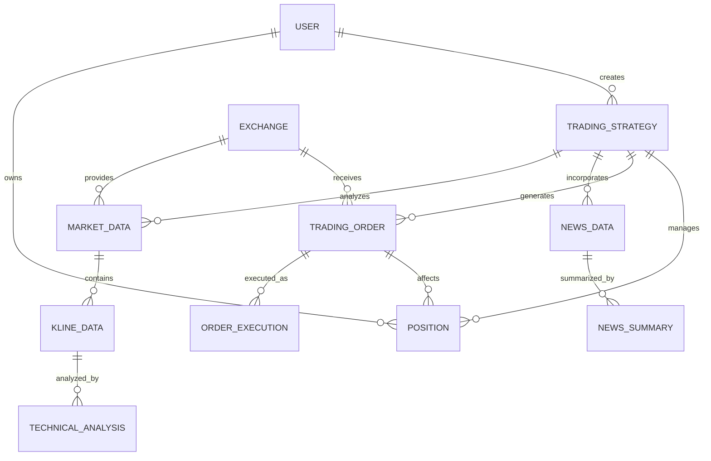

# 数据模型设计

**生成日期**: 2025-10-08
**系统**: 多Agent加密货币量化交易分析系统
**数据库**: PostgreSQL 16.3 + TimescaleDB 2.12

## 核心实体关系图



## 1. 核心交易实体

### 1.1 交易策略 (Trading Strategy)

```sql
CREATE TABLE trading_strategies (
    id UUID PRIMARY KEY DEFAULT gen_random_uuid(),
    name VARCHAR(100) NOT NULL,
    description TEXT,
    strategy_type VARCHAR(50) NOT NULL, -- 'long', 'short', 'neutral'
    status VARCHAR(20) NOT NULL DEFAULT 'active', -- 'active', 'paused', 'archived'

    -- LLM生成信息
    llm_provider VARCHAR(50) NOT NULL,
    llm_model VARCHAR(100) NOT NULL,
    confidence_score DECIMAL(3,2) CHECK (confidence_score >= 0 AND confidence_score <= 1),

    -- 策略参数
    entry_price DECIMAL(20,8),
    position_size DECIMAL(20,8),
    stop_loss_price DECIMAL(20,8),
    take_profit_price DECIMAL(20,8),

    -- 时间信息
    created_at TIMESTAMP WITH TIME ZONE DEFAULT NOW(),
    updated_at TIMESTAMP WITH TIME ZONE DEFAULT NOW(),
    expires_at TIMESTAMP WITH TIME ZONE,

    -- 外键
    created_by UUID REFERENCES users(id),
    symbol_id UUID REFERENCES trading_symbols(id)
);

CREATE INDEX idx_strategies_symbol_status ON trading_strategies(symbol_id, status);
CREATE INDEX idx_strategies_created_at ON trading_strategies(created_at DESC);
```

### 1.2 交易订单 (Trading Order)

```sql
CREATE TABLE trading_orders (
    id UUID PRIMARY KEY DEFAULT gen_random_uuid(),
    order_id VARCHAR(100) NOT NULL, -- 交易所订单ID

    -- 订单基本信息
    symbol VARCHAR(20) NOT NULL,
    side VARCHAR(10) NOT NULL, -- 'buy', 'sell'
    order_type VARCHAR(20) NOT NULL, -- 'market', 'limit', 'stop', 'stop_limit'
    amount DECIMAL(20,8) NOT NULL,
    price DECIMAL(20,8),

    -- 状态信息
    status VARCHAR(20) NOT NULL DEFAULT 'pending', -- 'pending', 'filled', 'cancelled', 'failed'
    filled_amount DECIMAL(20,8) DEFAULT 0,
    average_price DECIMAL(20,8),

    -- 风险管理
    stop_loss_price DECIMAL(20,8),
    take_profit_price DECIMAL(20,8),
    timeout_seconds INTEGER DEFAULT 300,

    -- 时间信息
    created_at TIMESTAMP WITH TIME ZONE DEFAULT NOW(),
    updated_at TIMESTAMP WITH TIME ZONE DEFAULT NOW(),
    filled_at TIMESTAMP WITH TIME ZONE,
    cancelled_at TIMESTAMP WITH TIME ZONE,

    -- 外键
    exchange_id UUID REFERENCES exchanges(id),
    strategy_id UUID REFERENCES trading_strategies(id),
    user_id UUID REFERENCES users(id)
);

CREATE INDEX idx_orders_symbol_status ON trading_orders(symbol, status);
CREATE INDEX idx_orders_strategy_id ON trading_orders(strategy_id);
CREATE INDEX idx_orders_created_at ON trading_orders(created_at DESC);
```

### 1.3 持仓信息 (Position)

```sql
CREATE TABLE positions (
    id UUID PRIMARY KEY DEFAULT gen_random_uuid(),

    -- 持仓基本信息
    symbol VARCHAR(20) NOT NULL,
    side VARCHAR(10) NOT NULL, -- 'long', 'short'
    amount DECIMAL(20,8) NOT NULL,
    average_cost DECIMAL(20,8) NOT NULL,

    -- 盈亏信息
    current_price DECIMAL(20,8),
    unrealized_pnl DECIMAL(20,8),
    realized_pnl DECIMAL(20,8) DEFAULT 0,

    -- 风险指标
    risk_exposure DECIMAL(20,8),
    margin_used DECIMAL(20,8),

    -- 时间信息
    opened_at TIMESTAMP WITH TIME ZONE DEFAULT NOW(),
    closed_at TIMESTAMP WITH TIME ZONE,
    updated_at TIMESTAMP WITH TIME ZONE DEFAULT NOW(),

    -- 外键
    exchange_id UUID REFERENCES exchanges(id),
    user_id UUID REFERENCES users(id)
);

CREATE INDEX idx_positions_symbol ON positions(symbol);
CREATE INDEX idx_positions_user_side ON positions(user_id, side);
CREATE INDEX idx_positions_opened_at ON positions(opened_at DESC);
```

## 2. 市场数据实体

### 2.1 交易符号 (Trading Symbol)

```sql
CREATE TABLE trading_symbols (
    id UUID PRIMARY KEY DEFAULT gen_random_uuid(),
    symbol VARCHAR(20) NOT NULL UNIQUE,
    base_asset VARCHAR(10) NOT NULL,
    quote_asset VARCHAR(10) NOT NULL,

    -- 符号信息
    status VARCHAR(20) NOT NULL DEFAULT 'active',
    is_spot_trading BOOLEAN DEFAULT true,
    is_margin_trading BOOLEAN DEFAULT false,

    -- 交易限制
    min_qty DECIMAL(20,8),
    max_qty DECIMAL(20,8),
    step_size DECIMAL(20,8),
    min_price DECIMAL(20,8),
    max_price DECIMAL(20,8),
    tick_size DECIMAL(20,8),

    created_at TIMESTAMP WITH TIME ZONE DEFAULT NOW(),
    updated_at TIMESTAMP WITH TIME ZONE DEFAULT NOW()
);
```

### 2.2 K线数据 (K-line Data) - TimescaleDB超表

```sql
-- 创建主表
CREATE TABLE kline_data (
    time TIMESTAMP WITH TIME ZONE NOT NULL,
    symbol_id UUID NOT NULL REFERENCES trading_symbols(id),
    exchange_id UUID NOT NULL REFERENCES exchanges(id),

    -- OHLCV数据
    open_price DECIMAL(20,8) NOT NULL,
    high_price DECIMAL(20,8) NOT NULL,
    low_price DECIMAL(20,8) NOT NULL,
    close_price DECIMAL(20,8) NOT NULL,
    volume DECIMAL(20,8) NOT NULL,
    quote_volume DECIMAL(20,8),

    -- 技术指标
    sma_20 DECIMAL(20,8),
    ema_12 DECIMAL(20,8),
    ema_26 DECIMAL(20,8),
    rsi DECIMAL(5,2),
    macd DECIMAL(20,8),
    macd_signal DECIMAL(20,8),
    bollinger_upper DECIMAL(20,8),
    bollinger_lower DECIMAL(20,8),

    PRIMARY KEY (time, symbol_id, exchange_id)
);

-- 转换为TimescaleDB超表
SELECT create_hypertable('kline_data', 'time', chunk_time_interval => INTERVAL '1 day');

-- 创建索引
CREATE INDEX idx_kline_symbol_time ON kline_data (symbol_id, time DESC);
CREATE INDEX idx_kline_exchange_time ON kline_data (exchange_id, time DESC);
```

### 2.3 技术分析结果 (Technical Analysis)

```sql
CREATE TABLE technical_analysis (
    id UUID PRIMARY KEY DEFAULT gen_random_uuid(),

    -- 分析信息
    symbol_id UUID NOT NULL REFERENCES trading_symbols(id),
    exchange_id UUID NOT NULL REFERENCES exchanges(id),
    timeframe VARCHAR(10) NOT NULL, -- '1m', '5m', '15m', '1h', '4h', '1d'

    -- 分析结果
    signal_type VARCHAR(20) NOT NULL, -- 'long', 'short', 'neutral'
    signal_strength DECIMAL(3,2) CHECK (signal_strength >= 0 AND signal_strength <= 1),

    -- 关键价格点
    support_level DECIMAL(20,8),
    resistance_level DECIMAL(20,8),

    -- 策略建议
    entry_conditions JSONB,
    exit_conditions JSONB,
    risk_factors JSONB,

    -- 元数据
    analysis_version VARCHAR(20) DEFAULT '1.0',
    confidence_score DECIMAL(3,2),

    created_at TIMESTAMP WITH TIME ZONE DEFAULT NOW()
);

CREATE INDEX idx_technical_symbol_timeframe ON technical_analysis(symbol_id, timeframe);
CREATE INDEX idx_technical_signal_strength ON technical_analysis(signal_strength DESC);
```

## 3. 新闻数据实体

### 3.1 新闻数据 (News Data)

```sql
CREATE TABLE news_data (
    id UUID PRIMARY KEY DEFAULT gen_random_uuid(),

    -- 新闻基本信息
    title VARCHAR(500) NOT NULL,
    content TEXT NOT NULL,
    url VARCHAR(1000),
    source VARCHAR(100) NOT NULL,
    author VARCHAR(200),

    -- 相关性信息
    relevance_score DECIMAL(3,2) CHECK (relevance_score >= 0 AND relevance_score <= 1),
    related_symbols TEXT[], -- 相关的交易符号
    sentiment VARCHAR(20) CHECK (sentiment IN ('positive', 'negative', 'neutral')),
    sentiment_score DECIMAL(3,2),

    -- 时间信息
    published_at TIMESTAMP WITH TIME ZONE NOT NULL,
    collected_at TIMESTAMP WITH TIME ZONE DEFAULT NOW(),

    -- 元数据
    language VARCHAR(10) DEFAULT 'en',
    word_count INTEGER,
    hash VARCHAR(64) UNIQUE, -- 内容哈希，避免重复
    created_at TIMESTAMP WITH TIME ZONE DEFAULT NOW()
);

CREATE INDEX idx_news_published_at ON news_data(published_at DESC);
CREATE INDEX idx_news_relevance ON news_data(relevance_score DESC);
CREATE INDEX idx_news_sentiment ON news_data(sentiment);
CREATE INDEX idx_news_related_symbols ON news_data USING GIN(related_symbols);
```

### 3.2 新闻摘要 (News Summary)

```sql
CREATE TABLE news_summaries (
    id UUID PRIMARY KEY DEFAULT gen_random_uuid(),

    -- 摘要信息
    summary_text TEXT NOT NULL,
    key_points JSONB,
    market_impact VARCHAR(20) CHECK (market_impact IN ('high', 'medium', 'low')),

    -- LLM生成信息
    llm_provider VARCHAR(50) NOT NULL,
    llm_model VARCHAR(100) NOT NULL,
    generation_confidence DECIMAL(3,2),

    -- 关联信息
    news_count INTEGER NOT NULL, -- 摘要的新闻数量
    time_period_hours INTEGER NOT NULL, -- 覆盖的时间段

    created_at TIMESTAMP WITH TIME ZONE DEFAULT NOW(),
    expires_at TIMESTAMP WITH TIME ZONE
);

CREATE INDEX idx_summaries_created_at ON news_summaries(created_at DESC);
CREATE INDEX idx_summaries_impact ON news_summaries(market_impact);
```

## 4. 系统配置实体

### 4.1 交易所配置 (Exchange)

```sql
CREATE TABLE exchanges (
    id UUID PRIMARY KEY DEFAULT gen_random_uuid(),
    name VARCHAR(100) NOT NULL UNIQUE,
    code VARCHAR(20) NOT NULL UNIQUE, -- 'binance', 'coinbase', etc.

    -- API配置
    api_base_url VARCHAR(500) NOT NULL,
    api_version VARCHAR(20),
    is_testnet BOOLEAN DEFAULT false,

    -- 限流配置
    rate_limit_requests_per_minute INTEGER,
    rate_limit_orders_per_second INTEGER,
    rate_limit_weight_per_minute INTEGER,

    -- 状态信息
    is_active BOOLEAN DEFAULT true,
    last_heartbeat TIMESTAMP WITH TIME ZONE,
    status VARCHAR(20) DEFAULT 'online', -- 'online', 'offline', 'maintenance'

    created_at TIMESTAMP WITH TIME ZONE DEFAULT NOW(),
    updated_at TIMESTAMP WITH TIME ZONE DEFAULT NOW()
);
```

### 4.2 用户配置 (User)

```sql
CREATE TABLE users (
    id UUID PRIMARY KEY DEFAULT gen_random_uuid(),
    username VARCHAR(100) NOT NULL UNIQUE,
    email VARCHAR(255) UNIQUE,

    -- 认证信息
    password_hash VARCHAR(255) NOT NULL,
    api_key VARCHAR(255) UNIQUE,
    api_secret VARCHAR(255),

    -- 用户配置
    timezone VARCHAR(50) DEFAULT 'UTC',
    language VARCHAR(10) DEFAULT 'en',
    risk_level VARCHAR(20) DEFAULT 'medium', -- 'low', 'medium', 'high'

    -- 权限信息
    is_active BOOLEAN DEFAULT true,
    is_admin BOOLEAN DEFAULT false,

    created_at TIMESTAMP WITH TIME ZONE DEFAULT NOW(),
    updated_at TIMESTAMP WITH TIME ZONE DEFAULT NOW(),
    last_login TIMESTAMP WITH TIME ZONE
);
```

## 5. 监控和日志实体

### 5.1 系统日志 (System Logs)

```sql
CREATE TABLE system_logs (
    id UUID PRIMARY KEY DEFAULT gen_random_uuid(),

    -- 日志信息
    level VARCHAR(20) NOT NULL, -- 'DEBUG', 'INFO', 'WARNING', 'ERROR', 'CRITICAL'
    message TEXT NOT NULL,
    module VARCHAR(100),
    function_name VARCHAR(100),

    -- 上下文信息
    user_id UUID REFERENCES users(id),
    session_id VARCHAR(255),
    request_id VARCHAR(255),
    ip_address INET,

    -- 额外数据
    metadata JSONB,
    stack_trace TEXT,

    created_at TIMESTAMP WITH TIME ZONE DEFAULT NOW()
);

-- 转换为TimescaleDB超表
SELECT create_hypertable('system_logs', 'created_at', chunk_time_interval => INTERVAL '1 day');

CREATE INDEX idx_logs_level_time ON system_logs (level, created_at DESC);
CREATE INDEX idx_logs_user_id ON system_logs (user_id, created_at DESC);
```

### 5.2 性能指标 (Performance Metrics)

```sql
CREATE TABLE performance_metrics (
    time TIMESTAMP WITH TIME ZONE NOT NULL,
    metric_name VARCHAR(100) NOT NULL,
    metric_value DECIMAL(15,6) NOT NULL,

    -- 标签信息
    tags JSONB,

    PRIMARY KEY (time, metric_name)
);

-- 转换为TimescaleDB超表
SELECT create_hypertable('performance_metrics', 'time', chunk_time_interval => INTERVAL '1 hour');

CREATE INDEX idx_metrics_name_time ON performance_metrics (metric_name, time DESC);
```

## 6. 数据验证规则

### 6.1 价格和数量验证

```sql
-- 价格必须为正数
ALTER TABLE trading_orders ADD CONSTRAINT check_positive_price
CHECK (price IS NULL OR price > 0);

-- 数量必须为正数
ALTER TABLE trading_orders ADD CONSTRAINT check_positive_amount
CHECK (amount > 0);

-- 百分比必须在0-100之间
ALTER TABLE trading_strategies ADD CONSTRAINT check_confidence_range
CHECK (confidence_score >= 0 AND confidence_score <= 1);
```

### 6.2 时间一致性验证

```sql
-- 订单创建时间不能早于当前时间
ALTER TABLE trading_orders ADD CONSTRAINT check_order_time_future
CHECK (created_at >= '1970-01-01');

-- 新闻发布时间不能是未来时间
ALTER TABLE news_data ADD CONSTRAINT check_news_time_past
CHECK (published_at <= NOW());
```

## 7. 数据保留策略

### 7.1 TimescaleDB数据保留

```sql
-- K线数据保留2年
SELECT add_retention_policy('kline_data', INTERVAL '2 years');

-- 系统日志保留3个月
SELECT add_retention_policy('system_logs', INTERVAL '3 months');

-- 性能指标保留6个月
SELECT add_retention_policy('performance_metrics', INTERVAL '6 months');
```

### 7.2 连续聚合视图

```sql
-- 1小时K线聚合
CREATE MATERIALIZED VIEW kline_1hour
WITH (timescaledb.continuous) AS
SELECT
    time_bucket('1 hour', time) AS hour,
    symbol_id,
    exchange_id,
    first(open_price, time) AS open,
    max(high_price) AS high,
    min(low_price) AS low,
    last(close_price, time) AS close,
    sum(volume) AS volume
FROM kline_data
GROUP BY hour, symbol_id, exchange_id;

-- 1天K线聚合
CREATE MATERIALIZED VIEW kline_1day
WITH (timescaledb.continuous) AS
SELECT
    time_bucket('1 day', time) AS day,
    symbol_id,
    exchange_id,
    first(open_price, time) AS open,
    max(high_price) AS high,
    min(low_price) AS low,
    last(close_price, time) AS close,
    sum(volume) AS volume
FROM kline_data
GROUP BY day, symbol_id, exchange_id;
```

## 8. 索引优化策略

### 8.1 复合索引

```sql
-- 交易订单复合索引
CREATE INDEX idx_orders_composite ON trading_orders(symbol, status, created_at DESC);

-- K线数据复合索引
CREATE INDEX idx_kline_composite ON kline_data(symbol_id, time DESC, exchange_id);

-- 技术分析复合索引
CREATE INDEX idx_technical_composite ON technical_analysis(symbol_id, signal_type, signal_strength DESC);
```

### 8.2 部分索引

```sql
-- 活跃订单索引
CREATE INDEX idx_active_orders ON trading_orders(symbol, created_at DESC)
WHERE status IN ('pending', 'partially_filled');

-- 高相关性新闻索引
CREATE INDEX idx_high_relevance_news ON news_data(published_at DESC)
WHERE relevance_score >= 0.8;
```

## 9. 数据迁移脚本

### 9.1 初始化脚本

```sql
-- 创建初始交易所数据
INSERT INTO exchanges (name, code, api_base_url, rate_limit_requests_per_minute) VALUES
('Binance', 'binance', 'https://api.binance.com', 1200),
('Coinbase', 'coinbase', 'https://api.coinbase.com', 600),
('Kraken', 'kraken', 'https://api.kraken.com', 900),
('Huobi', 'huobi', 'https://api.huobi.com', 6000),
('OKEx', 'okex', 'https://www.okex.com', 3600);

-- 创建主要交易符号
INSERT INTO trading_symbols (symbol, base_asset, quote_asset) VALUES
('BTC/USDT', 'BTC', 'USDT'),
('ETH/USDT', 'ETH', 'USDT'),
('BNB/USDT', 'BNB', 'USDT'),
('ADA/USDT', 'ADA', 'USDT'),
('SOL/USDT', 'SOL', 'USDT');
```

这个数据模型设计提供了完整的交易系统数据结构，支持高频交易、实时监控和历史数据分析，同时考虑了性能优化和数据完整性。